# AutoFlow AI X — Software Architecture & Design Documentation (SDD / SAD)

**Document Version:** 1.0.0  
**Status:** Canonical Software Design Document (SDD) & Systems Architecture Document (SAD)  
**Single Source of Truth Reference:** `MASTER_TECHNICAL_DOCUMENTATION_v2.md`  
**Target Audience:** Principal Systems Architects, UML Specialists, Software Engineers, Academic Evaluators  

---

## Table of Contents
1. [High-Level System Architecture](#1-high-level-system-architecture)
2. [Component Architecture](#2-component-architecture)
3. [Module Architecture](#3-module-architecture)
4. [Layered Architecture](#4-layered-architecture)
5. [Workflow Lifecycle](#5-workflow-lifecycle)
6. [Data Flow Diagrams (Level 0, 1, 2)](#6-data-flow-diagrams-level-0-1-2)
7. [Use Case Diagram & System Interactions](#7-use-case-diagram--system-interactions)
8. [Sequence Diagrams](#8-sequence-diagrams)
9. [Activity Diagrams](#9-activity-diagrams)
10. [State Machine Diagrams](#10-state-machine-diagrams)
11. [Deployment Architecture](#11-deployment-architecture)
12. [Database Architecture & Data Modeling](#12-database-architecture--data-modeling)
13. [Class Diagrams & Object Structural Relationships](#13-class-diagrams--object-structural-relationships)
14. [Runtime Architecture](#14-runtime-architecture)
15. [Security Architecture](#15-security-architecture)
16. [Integration Architecture](#16-integration-architecture)
17. [AI Architecture & Synthesis Loop](#17-ai-architecture--synthesis-loop)
18. [Design Principles](#18-design-principles)
19. [Design Patterns Implemented](#19-design-patterns-implemented)
20. [Engineering Decisions & Trade-off Matrix](#20-engineering-decisions--trade-off-matrix)

---

## 1. High-Level System Architecture

AutoFlow AI X operates as a distributed, AI-native automation platform designed to compile unstructured natural language business intent into deterministic, formally validated directed acyclic graphs (DAGs) executed across scalable runtime engines.

### 1.1 High-Level Architecture Diagram

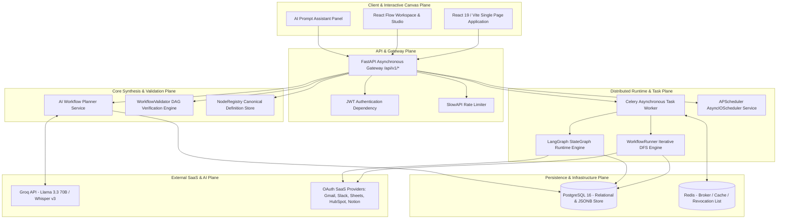

### 1.2 Subsystem Responsibilities, Inputs, Outputs, and Communication
| Subsystem | Responsibilities | Inputs | Outputs | Communication Mechanism |
| :--- | :--- | :--- | :--- | :--- |
| **Frontend UI** | Renders React Flow canvas, provides interactive node inspection, captures natural language prompts, and derives visual coordinates via Dagre. | User interactions, API JSON responses. | REST HTTP requests, canvas updates. | HTTPS/REST over browser `fetch` (`apiClient.js`). |
| **FastAPI Gateway** | Validates JWT bearer tokens, enforces IP/user rate limits (`SlowAPI`), routes endpoints, and manages application lifecycle. | HTTP requests (`POST`, `GET`, `PATCH`, `DELETE`). | Formatted JSON Pydantic responses (`200`, `201`, `202`, `400`, `401`, `422`). | WSGI/ASGI Uvicorn server protocol. |
| **AI Planner** | Compiles prompts into `WorkflowDSL`, injects few-shot schema specs, calls Groq LLM, and executes autonomous reflection/retry loops. | User prompt string, target industry, integration context. | Validated canonical `WorkflowDSL` Pydantic model. | REST over HTTPS to Groq (`llama-3.3-70b-versatile`). |
| **Validator** | Performs static DAG analysis: BFS reachability, Kahn's cycle detection, Jinja2 template reference validation, and credential checks. | `WorkflowDSL` JSON object. | `ValidationResult` (errors, warnings, `is_valid` flag). | In-memory synchronous Pydantic object evaluation. |
| **Database Layer** | Stores user identities, API keys, raw DSL JSON (`ai_context_json`), run execution telemetry, and encrypted OAuth tokens. | SQLAlchemy ORM models, SQL queries. | Transactional database rows, JSONB records. | TCP/IP connection pool (`psycopg2-binary`). |
| **Execution Engine** | Traverses graph either procedurally (`WorkflowRunner`) or statefully (`LangGraphRuntime`), resolving dynamic variables and executing plugins. | Celery task payload (`run_id`, `workflow_id`). | Execution step logs (`workflow_run_step_logs`), final run status. | Async Python execution inside Celery workers. |
| **External Services** | Third-party APIs providing email, messaging, CRM, spreadsheet operations, and LLM reasoning. | REST JSON payloads, OAuth 2.0 Bearer tokens. | External SaaS action confirmations, API payloads. | HTTPS REST requests via `http_client` / SDKs. |

---

## 2. Component Architecture

### 2.1 Complete Component Diagram

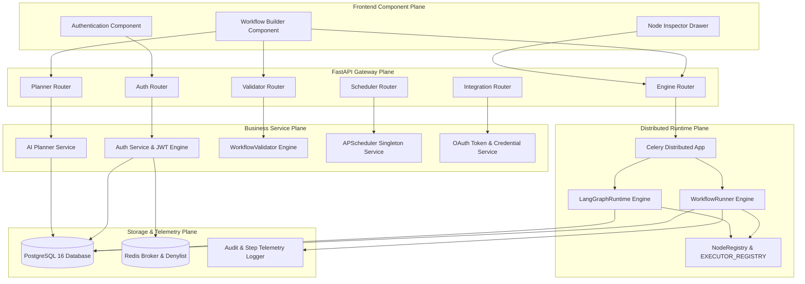

### 2.2 Component Specification Catalog
1. **Authentication Component:** Handles user registration (`/api/v1/auth/signup`), login (`/api/v1/auth/login`), JWT access/refresh token rotation, and immediate refresh token revocation via Redis denylisting.
2. **Workflow Builder Component:** Dual-mode React Flow canvas running `dslToFlow()` to derive nodes/edges from `WorkflowDSL` and Dagre `flowLayout.js` for left-to-right positional ranking.
3. **AI Planner Component (`WorkflowPlannerService`):** Orchestrates intent detection, Groq prompt compilation, structural JSON extraction (`_extract_json`), Pydantic validation, and static DAG checking.
4. **Validator Component (`WorkflowValidator`):** Evaluates `WorkflowDSL` schemas before persistence or execution, detecting circular dependencies, unreachable nodes, missing variables, or missing integration credentials.
5. **Runtime Component (`WorkflowRunner` / `LangGraphRuntime`):** Dual-mode runtime dispatching either iterative DFS graph traversal (`WorkflowRunner`) or LangGraph state machine execution (`LangGraphRuntime`).
6. **Scheduler Component (`SchedulerService`):** Singleton wrapping `AsyncIOScheduler` with `SQLAlchemyJobStore`, reconciling database schedule state at startup (`lifespan`).
7. **OAuth & Integration Component:** Manages OAuth 2.0 authorization code exchanges, encrypting access tokens via symmetric application encryption (`AES-256-GCM`).
8. **Node Registry Component (`NodeRegistry` & `EXECUTOR_REGISTRY`):** Canonical registry mapping declarative service/operation tuples (`NodeDefinition`) to executable concrete classes (`BaseExecutor`).

---

## 3. Module Architecture

### 3.1 Module Directory Catalog & Main Files
```
autoflow-ai/
├── backend/
│   ├── auth/              # JWT, bcrypt hashing, schemas, dependencies.py, router.py, service.py
│   ├── core/              # config.py (Pydantic Settings), redis.py, rate_limit.py (SlowAPI)
│   ├── database/          # models.py (10 SQLAlchemy models), session.py (SessionLocal)
│   ├── followup_engine/   # Interactive follow-up question generator for ambiguous prompts
│   ├── integrations/      # OAuth 2.0 flow handlers, token encryption, router.py, service.py
│   ├── intent_parser/     # Keyword intent detection and Gemini follow-up question generation
│   ├── routes/            # Standalone API endpoints (transcribe.py Whisper v3 handler)
│   ├── scheduler/         # AsyncIOScheduler wrapper, jobs.py, router.py, service.py
│   ├── services/          # whisper_service.py (Groq Whisper Large v3 speech-to-text)
│   ├── workers/           # celery_app.py (Celery config), tasks.py (async run_workflow_task)
│   ├── workflow/
│   │   ├── crud/          # CRUD router.py for Workflows and WorkflowNode DB synchronization
│   │   ├── dsl/           # schema.py (WorkflowDSL Pydantic models), validator.py
│   │   ├── engine/        # runner.py (WorkflowRunner), context.py, registry.py, executors/
│   │   ├── langgraph_engine/ # runtime.py (LangGraphRuntime), graph_builder.py, state.py
│   │   ├── planner/       # prompt.py, service.py (Groq LLM planning & reflection), router.py
│   │   └── validator/     # validator.py, checks/ (graph.py, schema.py, condition_keys.py)
│   └── main.py            # FastAPI lifespan, CORS, RateLimiter, Sentry middleware assembly
└── frontend/
    └── src/
        ├── components/    # Navbar.jsx, Sidebar.jsx, WorkflowNode.jsx, NodeInspector.jsx
        ├── context/       # AuthContext.jsx (<AuthProvider>)
        ├── pages/         # DashboardPage.jsx, WorkflowBuilderPage.jsx, LoginPage.jsx, LogsPage.jsx
        ├── services/      # apiClient.js, authApi.js, workflowApi.js, mutationService.js
        └── utils/         # flowLayout.js (Dagre LR auto-layout derivation)
```

### 3.2 Module Dependency Diagram

```mermaid
graph TD
    SubMain[backend/main.py] --> SubAuth[backend/auth]
    SubMain --> SubCore[backend/core]
    SubMain --> SubWorkflow[backend/workflow]
    SubMain --> SubScheduler[backend/scheduler]
    SubMain --> SubIntegrations[backend/integrations]
    SubMain --> SubWorkers[backend/workers]

    SubWorkflow --> SubDSL[workflow/dsl]
    SubWorkflow --> SubValidator[workflow/validator]
    SubWorkflow --> SubPlanner[workflow/planner]
    SubWorkflow --> SubEngine[workflow/engine]
    SubWorkflow --> SubLangGraph[workflow/langgraph_engine]

    SubPlanner --> SubDSL
    SubPlanner --> SubValidator
    SubEngine --> SubDSL
    SubLangGraph --> SubDSL
    SubLangGraph --> SubEngine

    SubWorkers --> SubEngine
    SubWorkers --> SubLangGraph
    SubScheduler --> SubWorkers
```

---

## 4. Layered Architecture

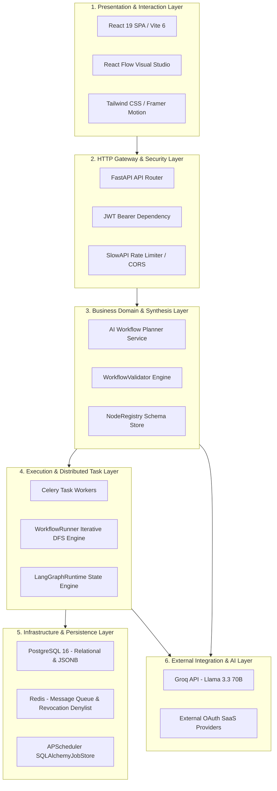

---

## 5. Workflow Lifecycle

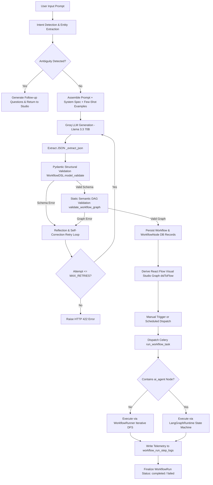

---

## 6. Data Flow Diagrams (Level 0, 1, 2)

### 6.1 Level 0 Context Diagram

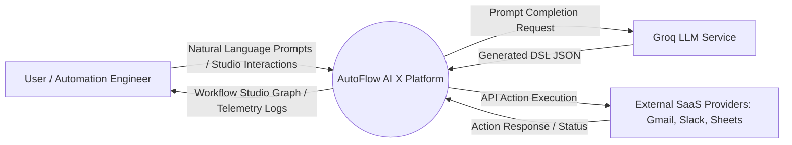

### 6.2 Level 1 Data Flow Diagram

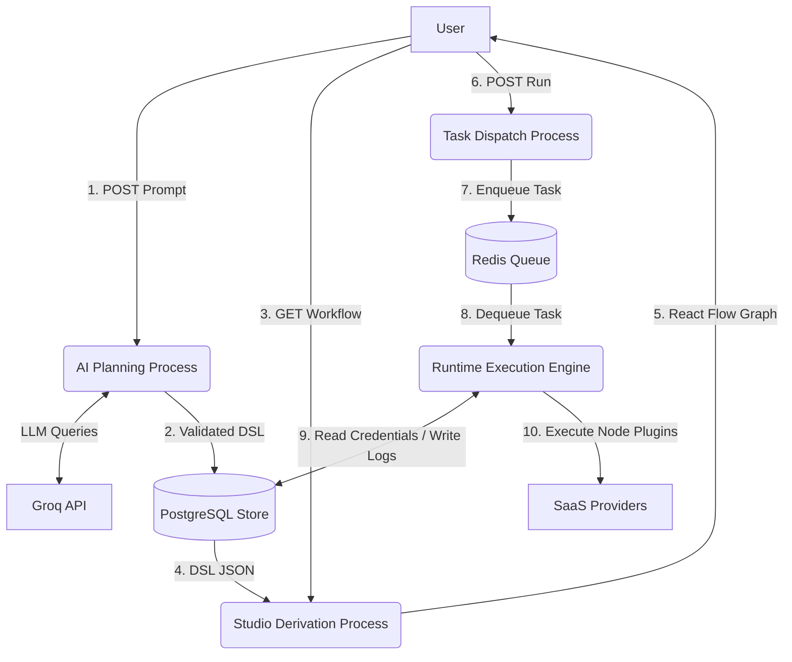

### 6.3 Level 2 Data Flow Diagram (Runtime Execution Engine Detailed)

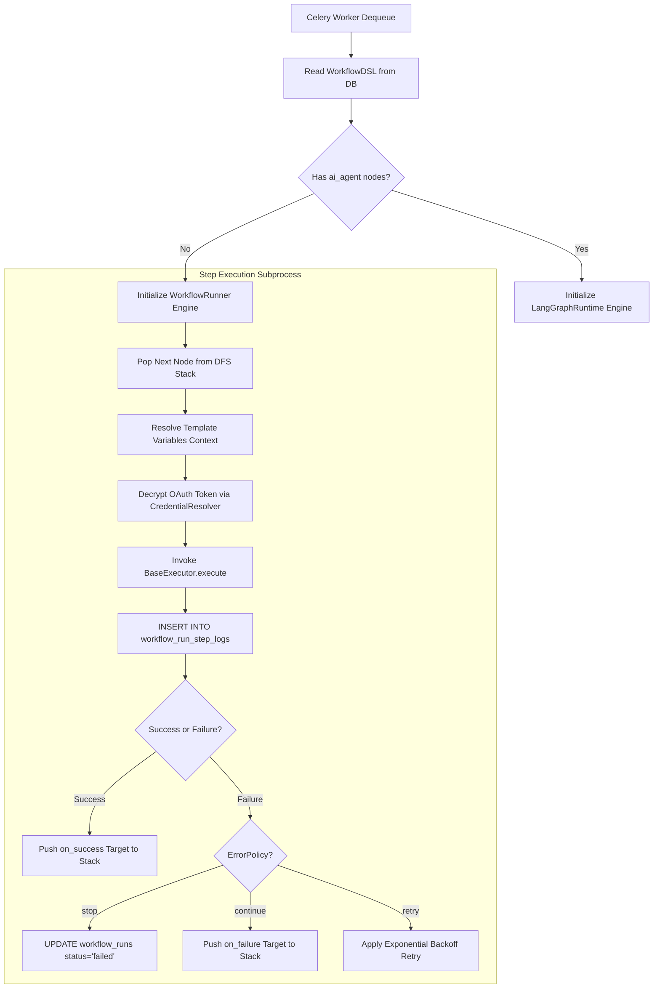

---

## 7. Use Case Diagram & System Interactions

```mermaid
graph LR
    actor User as Authenticated User
    actor Admin as Administrator
    actor SchedulerActor as APScheduler / Cron Trigger
    actor ExternalSaaS as External SaaS Service

    subgraph System [AutoFlow AI X Platform]
        UC1[Register & Authenticate Account]
        UC2[Plan Workflow from Natural Language]
        UC3[Edit & Configure Graph in Visual Studio]
        UC4[Connect OAuth Integration Provider]
        UC5[Manually Trigger Workflow Run]
        UC6[Schedule Recurring Workflow Execution]
        UC7[Inspect Execution Logs & Audit Trail]
        UC8[Execute Single Step in Isolation]
    end

    User --> UC1
    User --> UC2
    User --> UC3
    User --> UC4
    User --> UC5
    User --> UC6
    User --> UC7
    User --> UC8
    Admin --> UC7
    SchedulerActor --> UC6
    UC5 --> ExternalSaaS
    UC6 --> ExternalSaaS
    UC8 --> ExternalSaaS
```

---

## 8. Sequence Diagrams

### 8.1 User Authentication & Token Rotation Sequence

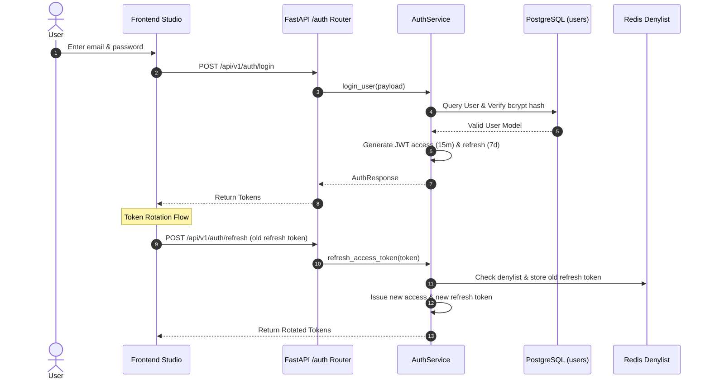

### 8.2 Prompt Planning & Reflection Loop Sequence

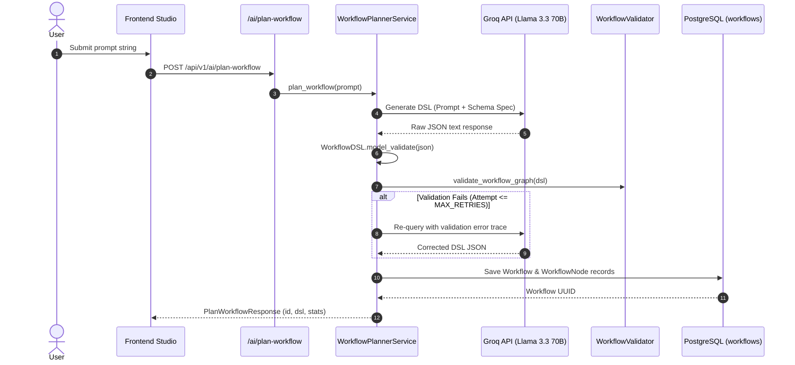

### 8.3 Workflow Execution Sequence

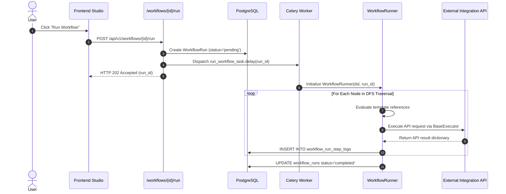

### 8.4 OAuth Connection Flow Sequence

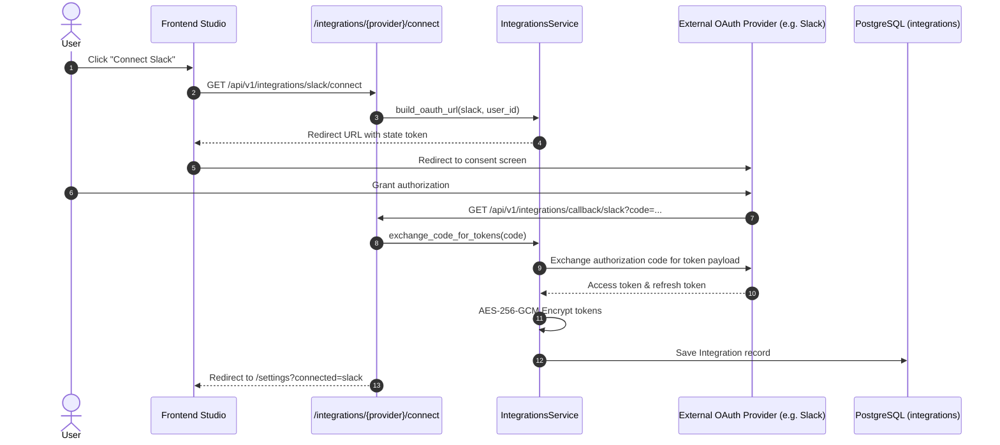

### 8.5 Scheduled Workflow Execution Sequence

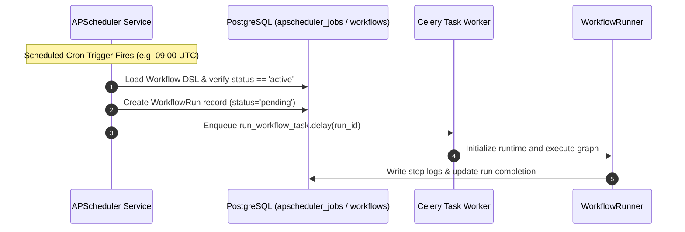

---

## 9. Activity Diagrams

### 9.1 Prompt Planning & Reflection Activity Diagram

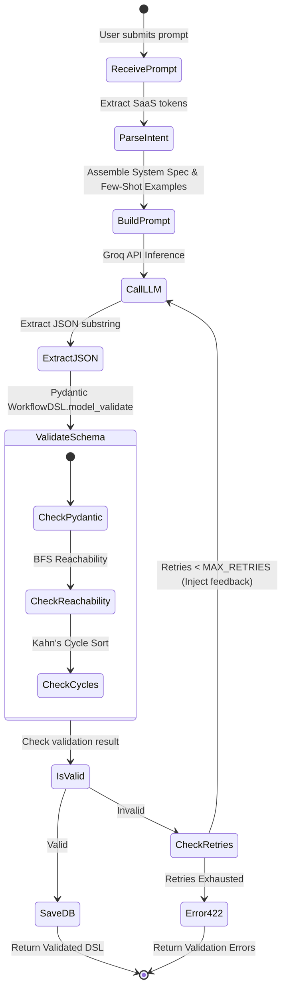

### 9.2 Node Step Execution Activity Diagram

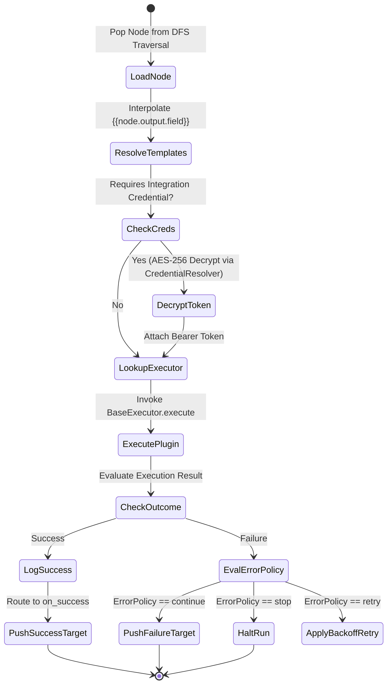

---

## 10. State Machine Diagrams

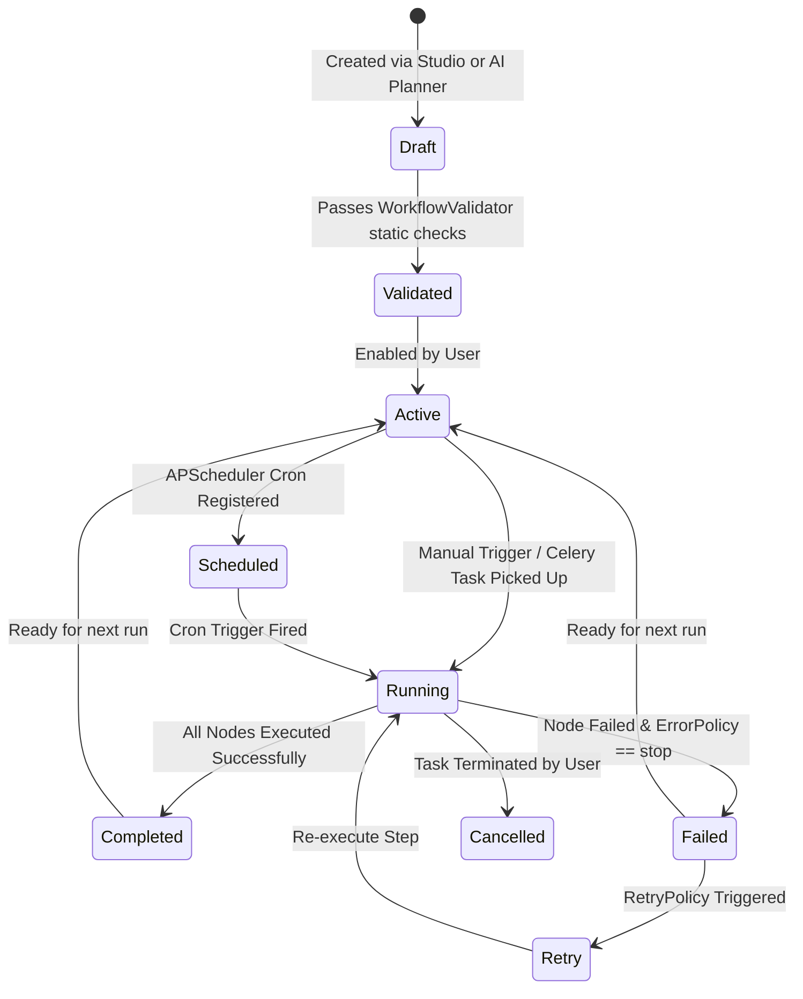

### 10.1 State Transition Definitions
- **Draft:** Newly created workflow or currently being edited; unverified against schema invariants.
- **Validated:** Graph reachability, cycle freedom, and template keys have passed static checks.
- **Active:** Workflow enabled and ready for manual or programmatic dispatch.
- **Scheduled:** Registered inside PostgreSQL `apscheduler_jobs` table.
- **Running:** Execution record created in `workflow_runs`; Celery task actively processing nodes.
- **Completed:** Terminal success state; all steps logged with `status = 'completed'`.
- **Failed:** Terminal failure state; an unrecoverable node error halted graph traversal.

---

## 11. Deployment Architecture

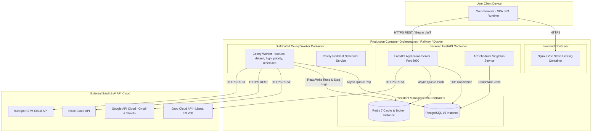

---

## 12. Database Architecture & Data Modeling

### 12.1 Verified ER Diagram & Entity Structure

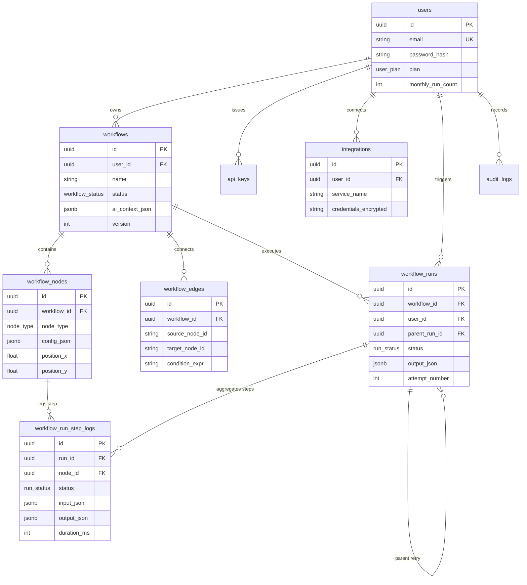

### 12.2 Key Indexing & Constraints
- **Primary Keys:** Every domain model uses UUIDv4 primary keys (`id = Column(UUID(as_uuid=True), primary_key=True, default=uuid.uuid4)`) except `audit_logs`, which uses a high-throughput integer sequence (`BIGSERIAL`).
- **Foreign Key Cascades:** `ON DELETE CASCADE` is applied from `Workflow` to `WorkflowNode`, `WorkflowEdge`, and `WorkflowRun`.
- **GIN JSONB Indexing:** Generalized Inverted Indexes (GIN) are enforced on `workflows.ai_context_json` and `workflow_run_step_logs.output_json` for high-performance JSON key queries.

---

## 13. Class Diagrams & Object Structural Relationships

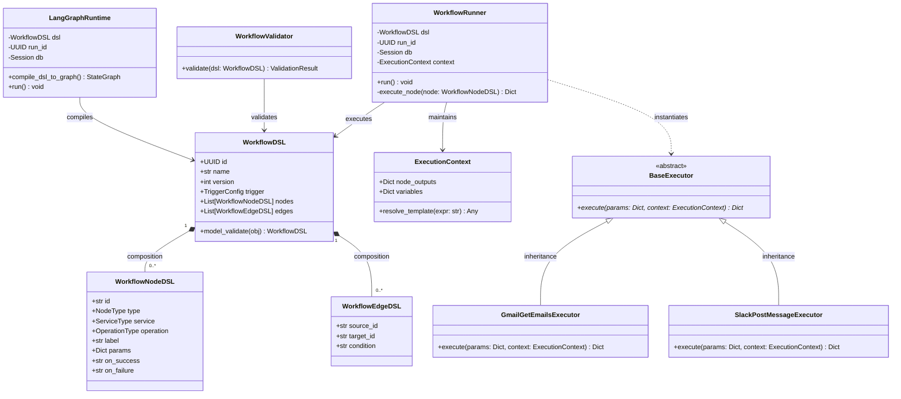

---

## 14. Runtime Architecture

```mermaid
graph TD
    TriggerEvent[Celery run_workflow_task.delay] --> DequeueWorker[Celery Task Worker]
    DequeueWorker --> CheckAI{Contains ai_agent?}
    CheckAI -- No --> Runner[WorkflowRunner Iterative DFS Engine]
    CheckAI -- Yes --> LangGraph[LangGraphRuntime State Engine]

    subgraph DFSExecutionLoop [Iterative DFS Traversal Loop]
        Runner --> PopNode[Pop Next Node from Stack]
        PopNode --> Interp[Resolve Context & Templates]
        Interp --> Cred[CredentialResolver Decrypt Token]
        Cred --> RegistryLookup[Lookup Executor in EXECUTOR_REGISTRY]
        RegistryLookup --> Invoke[Executor.execute]
        Invoke --> WriteTelemetry[Write Step Log to DB]
        WriteTelemetry --> RouteBranch{Check Node Outcome}
        RouteBranch -- Success --> PushSuccess[Push on_success Node]
        RouteBranch -- Failure --> EvalPolicy[Evaluate ErrorPolicy]
    end
```

---

## 15. Security Architecture

```mermaid
graph TD
    subgraph ClientPlane [Client Plane]
        Browser[React Studio]
    end

    subgraph SecurityGateway [FastAPI Gateway Plane]
        BearerDep[get_current_user Bearer Auth]
        SlowAPI[SlowAPI Rate Limiter]
    end

    subgraph SecretsManagement [Credential Security Plane]
        CredResolver[CredentialResolver Singleton]
        AESCipher[AES-256-GCM / Fernet Cryptographic Engine]
        DBStore[(PostgreSQL integrations table)]
    end

    Browser -- "1. Request + Authorization: Bearer <JWT>" --> SlowAPI
    SlowAPI --> BearerDep
    BearerDep -- "2. Validate Signature & Expiry" --> BearerDep
    BearerDep -- "3. Valid User" --> Router[Protected Endpoint]
    Router -- "4. Request Integration Execution" --> CredResolver
    CredResolver -- "5. Read credentials_encrypted" --> DBStore
    DBStore -- "6. Encrypted Ciphertext" --> CredResolver
    CredResolver -- "7. Decrypt Token in Memory" --> AESCipher
    AESCipher -- "8. Decrypted OAuth Access Token" --> CredResolver
```

---

## 16. Integration Architecture

```mermaid
graph LR
    subgraph CoreEngine [AutoFlow AI X Core]
        Planner[AI Workflow Planner]
        Registry[NodeRegistry & EXECUTOR_REGISTRY]
        Runner[Execution Engine]
    end

    subgraph IntegrationExecutors [Concrete Executor Plugins]
        Gmail[GmailExecutors]
        Slack[SlackExecutors]
        Sheets[SheetsExecutors]
        HubSpot[HubSpotExecutors]
        Notion[NotionExecutors]
        HTTP[HttpRequestExecutor]
    end

    subgraph CloudAPIs [Target External Cloud APIs]
        GoogleAPI[Google Workspace REST API]
        SlackAPI[Slack Web API v2]
        HubSpotAPI[HubSpot CRM API v3]
        NotionAPI[Notion Database API v1]
        WebhookAPI[Arbitrary External Webhook Targets]
    end

    Planner --> Registry
    Runner --> Registry
    Registry --> Gmail
    Registry --> Slack
    Registry --> Sheets
    Registry --> HubSpot
    Registry --> Notion
    Registry --> HTTP
    Gmail --> GoogleAPI
    Sheets --> GoogleAPI
    Slack --> SlackAPI
    HubSpot --> HubSpotAPI
    Notion --> NotionAPI
    HTTP --> WebhookAPI
```

---

## 17. AI Architecture & Synthesis Loop

```mermaid
graph TD
    PromptIn[1. User Natural Language Input] --> IntentDetect[2. Keyword & Intent Extraction]
    IntentDetect --> PromptBuild[3. PromptBuilder System Assembly]
    PromptBuild --> InjectSchema[4. Inject Canonical JSON Schema & Examples]
    InjectSchema --> GroqCall[5. Groq Llama 3.3 70B Generation]
    GroqCall --> JSONExtract[6. _extract_json Substring Extraction]
    JSONExtract --> PydanticVal[7. WorkflowDSL.model_validate]
    PydanticVal -- Schema Error --> RetryBuild[10. Assemble Error Trace Feedback Prompt]
    PydanticVal -- Valid --> GraphVal[8. validate_workflow_graph BFS/Kahn Check]
    GraphVal -- Graph Error --> RetryBuild
    RetryBuild --> RetryCheck{Attempt <= MAX_RETRIES?}
    RetryCheck -- Yes --> GroqCall
    RetryCheck -- No --> Abort422[Raise HTTP 422 Unprocessable Entity]
    GraphVal -- Valid Graph --> OutputDSL[9. Canonical Validated Workflow DSL]
```

---

## 18. Design Principles

1. **Separation of Concerns:** Strict decoupling between representation (`WorkflowDSL`), graph validation (`WorkflowValidator`), visual studio rendering (`React Flow`), and execution runtimes (`WorkflowRunner` / `LangGraphRuntime`).
2. **Modularity & Extensibility:** Adding a new integration requires zero modifications to the runner or planner; developers simply add an executor subclass and register it in `NodeRegistry` and `EXECUTOR_REGISTRY`.
3. **Loose Coupling:** The FastAPI HTTP web server is fully decoupled from graph execution via asynchronous Celery message queues over Redis.
4. **High Cohesion:** Every module encapsulates a distinct domain responsibility (e.g., `backend/auth/` handles all JWT rotation and user sessions).
5. **Fault Tolerance & Reliability:** Execution steps support per-node `RetryPolicy` backoffs and `ErrorPolicy` routing (`stop`, `continue`, `retry`), ensuring transient network glitches do not fail entire automation runs.

---

## 19. Design Patterns Implemented

| Design Pattern | Implementation Module | Code Verification & Architectural Role |
| :--- | :--- | :--- |
| **Registry Pattern** | `backend/workflow/node_registry.py`<br>`backend/workflow/engine/registry.py` | Maintains static dictionaries (`NodeRegistry.nodes`, `EXECUTOR_REGISTRY`) mapping declarative keys to metadata and executor classes. |
| **Factory Pattern** | `backend/workflow/engine/registry.py` | `get_executor_for_node(node)` acts as a factory instantiating the concrete `BaseExecutor` subclass matching the node's `service` and `operation`. |
| **Strategy Pattern** | `backend/workflow/engine/runner.py`<br>`backend/workflow/langgraph_engine/` | Selects runtime strategy (`WorkflowRunner` procedural DFS vs `LangGraphRuntime` agent state graph) dynamically based on node composition. |
| **Dependency Injection** | `backend/auth/dependencies.py`<br>`backend/database/session.py` | FastAPI `Depends(get_db)` and `Depends(get_current_user)` inject transactional database sessions and authenticated user profiles directly into route handlers. |
| **Template Method** | `backend/workflow/engine/executors/base.py` | Abstract `BaseExecutor` defines the uniform interface `execute(params, context)` implemented by all concrete SaaS plugins. |

---

## 20. Engineering Decisions & Trade-off Matrix

| Engineering Decision | Chosen Technology | Evaluated Alternative | Architectural Trade-off & Justification |
| :--- | :--- | :--- | :--- |
| **Backend Web Framework** | **FastAPI (Python 3.12)** | Django REST Framework | **Advantage:** Asynchronous `asyncio` loop performance and automatic Pydantic/OpenAPI validation.<br>**Trade-off:** Lacks built-in admin UI; requires custom SQLAlchemy session management. |
| **Persistence Database** | **PostgreSQL 16** | MongoDB / NoSQL | **Advantage:** Full ACID referential integrity across workflows/runs/logs with native `JSONB` indexing for dynamic DSL schemas.<br>**Trade-off:** Requires explicit schema migrations (`schema.sql`) for core tables. |
| **Distributed Queue** | **Celery + Redis Broker** | Python `asyncio` BackgroundTasks | **Advantage:** Persistent task execution across server restarts, multi-queue routing, and horizontal worker autoscaling.<br>**Trade-off:** Introduces Redis broker operational dependency. |
| **Visual Studio Engine** | **React Flow (`@xyflow/react`)** | Custom HTML5 Canvas / D3.js | **Advantage:** Production-grade viewport virtualization, minimaps, custom node components, and Dagre layout integration.<br>**Trade-off:** Adds `@xyflow/react` bundle dependency. |
| **Canonical Spec** | **Workflow DSL (JSON Pydantic)** | YAML / Custom Scripting | **Advantage:** JSON compiles cleanly across REST APIs, frontend canvas state, and LLM structured generation.<br>**Trade-off:** Verbose syntax compared to raw YAML syntax. |
| **Primary LLM Engine** | **Groq Llama 3.3 70B** | OpenAI GPT-4o sole reliance | **Advantage:** Sub-second inference latency critical for interactive UI planning loops with low deterministic temperature (`0.2`).<br>**Trade-off:** Requires fallback configuration for complex speech/audio tasks. |
