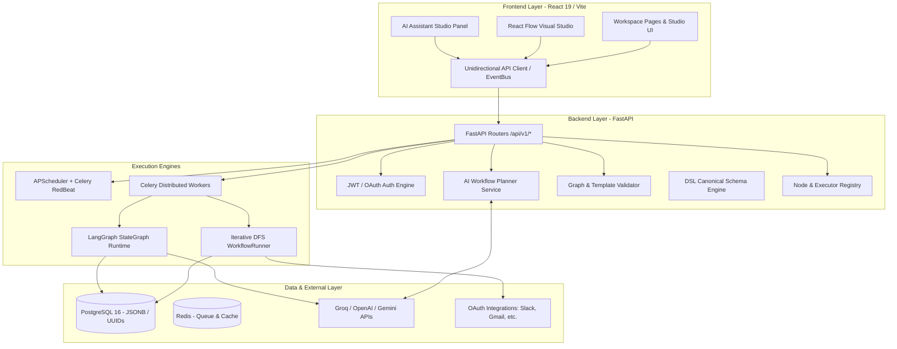
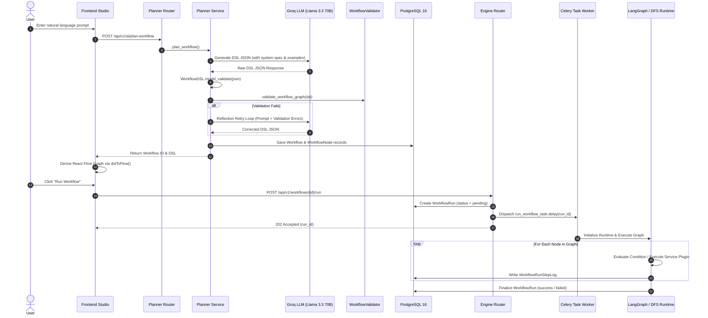
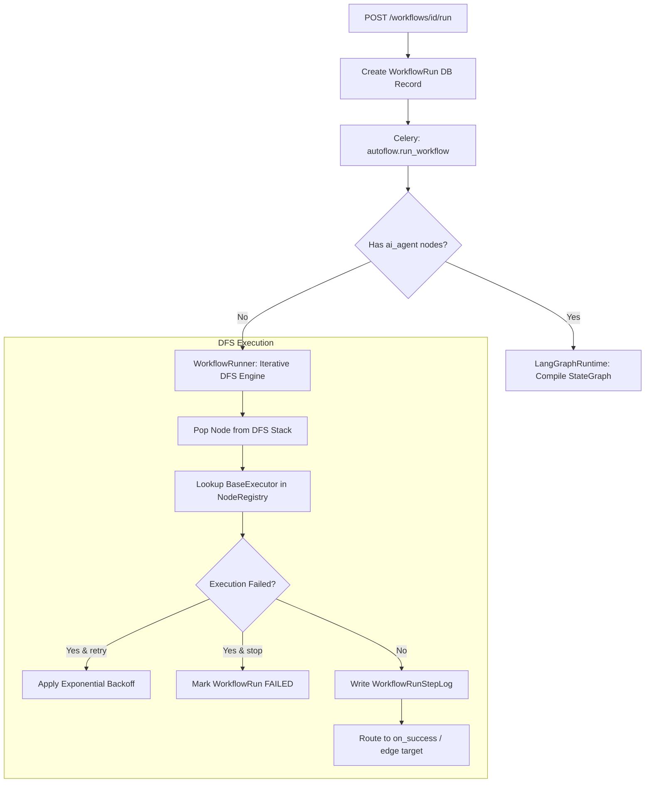
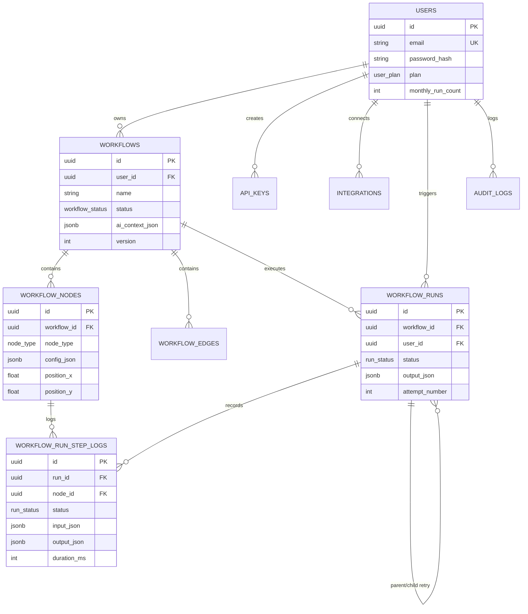

# AutoFlow AI X — Master Technical & Architectural Documentation

**Document Version:** 1.0.0  
**Status:** Canonical Engineering Reference  
**Audience:** Principal Architects, Core Platform Engineers, New Onboarding Developers  

---

## Table of Contents
1. [Project Overview](#1-project-overview)
2. [Folder Structure](#2-folder-structure)
3. [Frontend Architecture](#3-frontend-architecture)
4. [Backend Architecture](#4-backend-architecture)
5. [Workflow Lifecycle](#5-workflow-lifecycle)
6. [DSL Documentation](#6-dsl-documentation)
7. [Runtime](#7-runtime)
8. [Integrations](#8-integrations)
9. [Database](#9-database)
10. [APIs](#10-apis)
11. [Authentication](#11-authentication)
12. [AI Components](#12-ai-components)
13. [Algorithms](#13-algorithms)
14. [Libraries](#14-libraries)
15. [Design Decisions](#15-design-decisions)
16. [Current Limitations](#16-current-limitations)
17. [Future Improvements](#17-future-improvements)

---

## 1. Project Overview

### 1.1 Project Purpose & Main Objective
**AutoFlow AI X** is an AI-native workflow automation platform designed to bridge natural language business intent and production-grade, self-monitoring distributed system execution. Its primary objective is to allow technical and non-technical users to express complex multi-step business requirements in natural language (e.g., *"Every morning at 9 AM, fetch unread customer emails, classify their urgency with AI, alert Slack if urgent, and log to Google Sheets"*) and automatically compile that request into a deterministic, formally validated, JSON-based **Domain-Specific Language (DSL)** graph.

### 1.2 Major Capabilities
- **Natural Language Workflow Planning (`/api/v1/ai/plan-workflow`):** Compiles natural language prompts into structured `WorkflowDSL` graphs using Groq (`llama-3.3-70b-versatile`) with an autonomous reflection and self-correction loop.
- **Interactive Intent & Follow-up Clarification (`/api/v1/ai/parse-intent`, `/api/v1/followup/questions`):** Business analyst reasoning loop that identifies missing parameters or ambiguities before generation.
- **Visual Studio & Interactive Canvas (`@xyflow/react` + Dagre layout):** Dual-mode interface where users can drag nodes, inspect parameter schemas, test single nodes in isolation, and mutate the underlying DSL via natural language chat.
- **Dual Runtime Engine:**
  - **Iterative DFS Engine (`WorkflowRunner`):** Fast, lightweight runtime for classic automation DAGs (conditional branches, loops, delays, transformers, webhook listeners, cron triggers).
  - **LangGraph Agent Engine (`LangGraphRuntime`):** Stateful agent runtime compiling workflows containing `ai_agent` nodes into `langgraph.graph.StateGraph` structures.
- **Persistent Multi-Queue Distributed Execution:** Celery workers backed by Redis and RedBeat schedulers, alongside an embedded APScheduler backed by a PostgreSQL job store (`apscheduler_jobs`).
- **Comprehensive Verification & Diagnostics:** Static graph validation engine (`WorkflowValidator`) checking schema validity, reachability, cycle detection, credential availability, and Jinja2-style `{{node_id.output.field}}` template references prior to runtime.

### 1.3 Target Users
1. **Automation Engineers & DevOps:** Building reliable cross-SaaS integration pipelines with granular retry policies and execution telemetry.
2. **Product & Operations Teams:** Generating end-to-end operational workflows from natural language without writing boilerplate API glue code.
3. **Platform Developers:** Extending the system via structured plugin registries (`NodeRegistry`, `EXECUTOR_REGISTRY`).

### 1.4 Overall Architecture



---

## 2. Folder Structure

Every directory in the codebase serves an explicit architectural separation of concerns. Below is the annotated layout based directly on filesystem inspection:

```
autoflow-ai/
├── backend/                        # Backend FastAPI Application & Distributed Workers
│   ├── auth/                       # Authentication engine (JWT, bcrypt, schemas, router, dependencies)
│   ├── core/                       # Core platform configuration (Pydantic Settings, Redis pool, Rate Limiter)
│   ├── database/                   # SQLAlchemy declarative models, SessionLocal factory, DDL schema.sql
│   ├── followup_engine/            # Interactive follow-up question generator for ambiguous user requests
│   ├── gmail/                      # Dedicated Gmail test and helper endpoints
│   ├── integrations/               # OAuth 2.0 flow handlers, token encryption, and provider connection routes
│   ├── intent_parser/              # Natural language intent detection and Gemini follow-up question engine
│   ├── routes/                     # Specialized standalone endpoints (e.g., audio transcription via Whisper)
│   ├── scheduler/                  # APScheduler async service, cron reconciliation, and scheduler endpoints
│   ├── services/                   # Shared utility services (e.g., Whisper audio transcription service)
│   ├── tests/                      # Pytest verification suites
│   ├── workers/                    # Celery app configuration, task queues, and asynchronous workers
│   ├── workflow/                   # Core workflow platform domain
│   │   ├── crud/                   # CRUD operations for Workflow ORM models and node synchronization
│   │   ├── dsl/                    # Canonical Pydantic DSL schemas and structural validators
│   │   ├── engine/                 # Iterative DFS runtime runner, ExecutionContext, CredentialResolver, Executors
│   │   │   └── executors/          # Plugin implementations (Gmail, Sheets, Slack, HubSpot, Notion, AI Agents)
│   │   ├── langgraph_engine/       # LangGraph compiler, StateGraph builders, agent nodes, and runtime
│   │   ├── planner/                # AI Planner service, prompt templates, schema extraction, reflection loop
│   │   └── validator/              # Static DAG validation engine and individual check modules
│   │       └── checks/             # Modules for cycles, reachability, schema, schedule, template keys
│   └── main.py                     # FastAPI lifespan application entrypoint and middleware assembly
├── frontend/                       # Frontend Single-Page Application (React 19 + Vite)
│   ├── public/                     # Static web assets
│   └── src/
│       ├── components/             # Reusable UI components (Navbar, Sidebar, WorkflowNode, NodeInspector)
│       ├── context/                # React Context providers (AuthContext)
│       ├── pages/                  # Route views (Dashboard, WorkflowBuilderPage, LoginPage, LogsPage, etc.)
│       ├── routes/                 # Route guards (ProtectedRoute)
│       ├── services/               # Typed REST API wrappers (apiClient, authApi, workflowApi, mutationService)
│       ├── utils/                  # Domain algorithms (Dagre flowLayout auto-positioning engine)
│       ├── App.jsx                 # Top-level route hierarchy and floating workspace configuration drawer
│       └── main.jsx                # React root DOM renderer
├── docs/                           # Architecture specifications and Request For Comments (RFC-000 to RFC-005)
├── shared/                         # Cross-boundary shared schemas or protocol definitions
├── Dockerfile.backend              # Production container specification for FastAPI application & workers
├── Dockerfile.frontend             # Production container specification for Vite build & static hosting
└── docker-compose.yml              # Local multi-container orchestration (Postgres, Redis, Backend, Worker, Beat)
```

### 2.1 Rationale Behind Folder Breakdown
- `backend/workflow/`: Encapsulates the entire domain logic of workflows. Separating `dsl/` (static representation), `validator/` (graph correctness), `engine/` (DFS execution), `langgraph_engine/` (agentic execution), and `planner/` (AI synthesis) prevents circular dependencies and ensures the execution runtime never imports web layer or LLM planning dependencies.
- `backend/workflow/engine/executors/`: Isolates integration execution payloads. Adding a new SaaS integration only requires adding a file here and registering it in `NodeRegistry`.
- `frontend/src/services/` & `frontend/src/utils/`: Separates HTTP communication (`apiClient.js`, `workflowApi.js`) and purely functional graph geometry transformations (`flowLayout.js`) from visual React rendering components.

---

## 3. Frontend Architecture

### 3.1 React Architecture & Core Design
The frontend is built on **React 19** bundled via **Vite 6** and styled with **Tailwind CSS v4** plus **Framer Motion 12**.
Unidirectional data flow is enforced across the application:
1. **Canonical State:** The JSON `WorkflowDSL` object (`plannedDsl`) is the single source of truth inside `WorkflowBuilderPage.jsx`.
2. **Graph Derivation:** The React Flow visual graph (`nodes`, `edges`) is pure derived state generated by running `dslToFlow(plannedDsl, savedPositions)` whenever the DSL mutates.
3. **Position Persistence:** Dragged coordinates are stored separately in `savedPositions` (`{ [nodeId]: { x, y } }`), guaranteeing that programmatic DSL mutations or AI chat edits never reset canvas layouts.

### 3.2 Page Catalog
| Component Page | Route | Purpose & Code Reality |
| :--- | :--- | :--- |
| `LoginPage` | `/login` | Email/password login interfacing with `/api/v1/auth/login`. |
| `SignupPage` | `/signup` | User registration enforcing password strength (`/api/v1/auth/signup`). |
| `DashboardPage` | `/`, `/dashboard` | Workspace overview listing recent workflows, execution quotas, and status cards. |
| `WorkflowBuilderPage` | `/workflows/builder`, `/workflows/edit/:id` | Dual-mode React Flow canvas + AI Assistant panel + Node Inspector drawer. |
| `MarketplacePage` | `/marketplace` | Template gallery allowing one-click cloning of pre-built `IndustryTemplate` DSLs. |
| `LogsPage` | `/logs` | Execution audit viewer rendering granular `WorkflowRun` and `WorkflowRunStepLog` histories. |
| `SettingsPage` | `/settings` | Account profile, API key management (`ApiKey`), and integration connections (`Integration`). |

### 3.3 Component Breakdown
- `Navbar.jsx`: Top workspace bar rendering user identity, global status indicators, and settings drawer trigger.
- `Sidebar.jsx`: Collapsible navigation sidebar with dynamic route highlighting.
- `WorkflowNode.jsx`: Custom React Flow node renderer (`type: 'workflowNode'`). Displays icon, label, service badge, disabled state overlay, status border styling, and input/output handles.
- `NodeInspector.jsx`: Comprehensive side drawer for configuring a selected node. Provides dynamic form fields driven by `NodeRegistry.parameter_schema`, credential selectors, routing target selectors (`on_success`, `on_failure`), retry policy sliders (`max_attempts`, `backoff_seconds`), error policy selectors (`stop`, `continue`, `retry`), and single-node execution (`/api/v1/workflows/{id}/nodes/{nodeId}/execute`).
- `ValidationPanel`: Displays real-time error/warning diagnostics returned by `WorkflowValidator`, highlighting offending `node_id` entries.

### 3.4 State Management & Routing
- **Global Auth State:** Managed via `AuthContext.jsx` (`<AuthProvider>`). Stores `user`, `accessToken`, and `refreshToken` in memory and `localStorage`.
- **Protected Navigation:** `ProtectedRoute.jsx` intercepts unauthenticated attempts and redirects to `/login`.
- **Workspace Wrapper:** `WorkspaceLayout` in `App.jsx` wraps authenticated workspace routes, managing sidebar collapse state and interactive floating settings drawer.

### 3.5 Workflow Builder & React Flow Integration
Inside `WorkflowBuilderPage.jsx`:
- React Flow canvas is bound to `nodeTypes = { workflowNode: WorkflowNode }`.
- When a workflow is loaded or generated, `dslToFlow(dsl, savedPositions)` maps `WorkflowNodeDSL` objects to React Flow node objects and `WorkflowEdgeDSL` to styled animated edges.
- Node layout auto-calculation uses Dagre (`flowLayout.js`) with left-to-right (`LR`) hierarchical arrangement when existing position data is absent.

```javascript
// Excerpt from frontend/src/utils/flowLayout.js showing deterministic Dagre layout
export function dslToFlow(dsl, savedPositions = {}) {
  const nodes = (dsl.nodes || []).map((n) => {
    const pos = savedPositions[n.id] || { x: 0, y: 0 };
    return {
      id: n.id,
      type: 'workflowNode',
      position: pos,
      data: {
        id: n.id,
        label: n.label || n.id,
        service: n.service,
        operation: n.operation,
        nodeType: n.type,
        params: n.params || {},
        is_disabled: n.is_disabled || false,
      },
    };
  });
  // Layout application via Dagre when positions are (0,0) ...
}
```

### 3.6 API Communication Layer
- `apiClient.js`: Central wrapper around browser `fetch`. Intercepts requests to automatically attach `Authorization: Bearer <token>`, handles HTTP 401 responses by triggering token refresh (`/api/v1/auth/refresh`), and surfaces standard errors.
- `workflowApi.js`: Typed service object exposing `listWorkflows`, `getWorkflow`, `createWorkflow`, `updateWorkflow`, `deleteWorkflow`, `validateWorkflow`, `runWorkflow`, `getRun`, and `executeNodeStep`.
- `mutationService.js`: Applies incremental, non-destructive DSL patches (adding nodes, updating params, connecting edges) requested by user actions or AI studio assistant suggestions.

---

## 4. Backend Architecture

### 4.1 FastAPI Application Design (`main.py`)
The backend is an asynchronous Python 3.12 FastAPI application designed for high availability and strict schema enforcement.
- **Lifespan Manager:** The `@asynccontextmanager` lifespan function initializes `SchedulerService` (`scheduler_service.init()`), starts the scheduler, and reconciles database state by checking for active scheduled workflows on boot. On shutdown, it gracefully terminates APScheduler and closes the Redis connection pool.
- **Middleware Assembly:**
  - `CORSMiddleware`: Configured dynamically from `settings.ALLOWED_ORIGINS`.
  - `SlowAPI`: Rate limiting engine (`limiter`) protecting endpoints like `/auth/login` and `/auth/signup`.
  - `Sentry SDK`: Distributed tracing and error capture (`settings.SENTRY_DSN`).

### 4.2 Router Architecture
All API routers are mounted under `/api/v1` in `main.py`:

```python
app.include_router(auth_router, prefix="/api/v1")         # /api/v1/auth/*
app.include_router(intent_router, prefix="/api/v1")       # /api/v1/ai/parse-intent
app.include_router(followup_router, prefix="/api/v1")     # /api/v1/followup/questions
app.include_router(planner_router, prefix="/api/v1")      # /api/v1/ai/plan-workflow
app.include_router(crud_router, prefix="/api/v1")         # /api/v1/workflows
app.include_router(validator_router, prefix="/api/v1")    # /api/v1/workflows/validate
app.include_router(engine_router, prefix="/api/v1")       # /api/v1/workflows/{id}/run, runs, etc.
app.include_router(scheduler_router, prefix="/api/v1")    # /api/v1/workflows/{id}/schedule
app.include_router(gmail_router, prefix="/api/v1")        # /api/v1/gmail/test-send
app.include_router(integrations_router, prefix="/api/v1") # /api/v1/integrations/*
app.include_router(transcribe_router, prefix="/api/v1")   # /api/v1/transcribe
```

### 4.3 Service Layer & Separation of Concerns
Routers remain thin HTTP dispatchers. All transactional operations reside in dedicated service modules:
- `backend/auth/service.py`: Password hashing (`bcrypt`), JWT construction, refresh rotation, and logout denylisting.
- `backend/workflow/planner/service.py`: Orchestrates prompt compilation, Groq LLM invocation, Pydantic validation, and static DAG checking.
- `backend/scheduler/service.py`: Encapsulates APScheduler job store interactions and job ID conventions (`autoflow:workflow:{uuid}`).

### 4.4 Dependency Injection & Configuration
- **Database Dependency (`get_db`):** Yields transactional SQLAlchemy `Session` objects from `SessionLocal`.
- **Auth Dependency (`get_current_user`):** Decodes JWT Bearer tokens, validates access token claims, and retrieves the active `User` model.
- **Configuration (`get_settings`):** Strongly typed environment variables via `pydantic_settings.BaseSettings` (`config.py`), validating JWT secrets, database connection URIs, Redis URLs, and API keys at startup.

---

## 5. Workflow Lifecycle

The complete lifecycle of a workflow—from natural language request to execution completion—follows a strict, deterministic sequence:



---

## 6. DSL Documentation

The **Domain-Specific Language (DSL)** is the canonical, executable representation of every workflow in AutoFlow AI X. It is strictly typed via Pydantic in `backend/workflow/dsl/schema.py`.

### 6.1 Root DSL Specification (`WorkflowDSL`)
```json
{
  "$schema": "https://autoflow.ai/schemas/dsl/v1.json",
  "id": "e8a93a62-74c1-4b10-8e1f-49b068225091",
  "name": "Daily Support Ticket Triage Pipeline",
  "description": "Fetches unread support emails, classifies urgency, alerts Slack, and logs to Sheets.",
  "version": 1,
  "migration_version": 1,
  "compiler_version": "1.0.0",
  "industry": "customer_support",
  "trigger": {
    "type": "schedule",
    "config": {
      "cron": "0 9 * * 1-5",
      "timezone": "UTC"
    }
  },
  "variables": {
    "support_slack_channel": "#urgent-support",
    "max_emails": 25
  },
  "nodes": [
    {
      "id": "start",
      "type": "trigger",
      "service": "scheduler",
      "operation": "cron",
      "label": "Morning Cron Trigger",
      "params": {
        "cron_expression": "0 9 * * 1-5",
        "timezone": "UTC"
      }
    },
    {
      "id": "fetch_emails",
      "type": "action",
      "service": "gmail",
      "operation": "get_emails",
      "label": "Fetch Unread Support Emails",
      "params": {
        "query": "is:unread label:support",
        "max_results": "{{vars.max_emails}}"
      },
      "on_success": "check_count",
      "error_policy": "stop"
    },
    {
      "id": "check_count",
      "type": "condition",
      "service": "builtin",
      "operation": "condition_branch",
      "label": "Emails Found?",
      "params": {
        "condition": "{{fetch_emails.output.count > 0}}"
      },
      "on_success": "classify_urgency",
      "on_failure": null
    },
    {
      "id": "classify_urgency",
      "type": "ai_agent",
      "service": "groq",
      "operation": "llm_classify",
      "label": "AI Classify Urgency",
      "params": {
        "input_text": "{{fetch_emails.output.emails[0].snippet}}",
        "categories": ["urgent", "normal", "spam"],
        "model": "llama-3.3-70b-versatile"
      },
      "on_success": "notify_slack",
      "retry_policy": {
        "max_attempts": 3,
        "backoff_seconds": 15,
        "backoff_multiplier": 2.0
      }
    },
    {
      "id": "notify_slack",
      "type": "action",
      "service": "slack",
      "operation": "post_message",
      "label": "Post Slack Alert",
      "params": {
        "channel": "{{vars.support_slack_channel}}",
        "text": "🚨 Urgent Support Email: {{fetch_emails.output.emails[0].subject}}"
      },
      "on_success": null
    }
  ],
  "edges": [
    { "source_id": "start", "target_id": "fetch_emails" },
    { "source_id": "fetch_emails", "target_id": "check_count" },
    { "source_id": "check_count", "target_id": "classify_urgency", "label": "true", "condition": "{{check_count.output.result == true}}" },
    { "source_id": "classify_urgency", "target_id": "notify_slack" }
  ]
}
```

### 6.2 DSL Node Schema (`WorkflowNodeDSL`)
| Field | Type | Required | Description |
| :--- | :--- | :---: | :--- |
| `id` | String | Yes | Unique snake_case identifier (`^[a-z][a-z0-9_]*$`). Reserved words (`start`, `null`, etc.) are forbidden. |
| `type` | `NodeType` Enum | Yes | `trigger`, `action`, `condition`, `delay`, `loop`, `ai_agent`, `transformer`. |
| `service` | `ServiceType` Enum | Yes | `gmail`, `slack`, `google_sheets`, `groq`, `openai`, `http`, `builtin`, `scheduler`. |
| `operation` | `OperationType` Enum | Yes | Specific plugin operation (e.g., `send_email`, `post_message`, `llm_generate`). |
| `label` | String | Yes | Human-readable title displayed on visual studio nodes. |
| `params` | Object | Yes | Operation parameters supporting Jinja2-style variable interpolation (`{{node_id.output.field}}`). |
| `credential_id` | String | No | UUID of the connected integration credentials (`Integration`). |
| `on_success` | String | No | Downstream node ID to execute upon successful step completion. |
| `on_failure` | String | No | Downstream node ID to execute if step fails and `error_policy` allows continuation. |
| `retry_policy` | Object | No | `{ "max_attempts": int, "backoff_seconds": int, "backoff_multiplier": float }`. |
| `error_policy` | `ErrorPolicy` Enum | No | `stop` (halt run), `continue` (route to `on_failure`), `retry` (execute retry backoff). |

---

## 7. Runtime

AutoFlow AI X implements a resilient dual runtime engine.

### 7.1 Execution Engine Architecture
- **Iterative DFS Engine (`WorkflowRunner` in `backend/workflow/engine/runner.py`):**
  Uses an iterative depth-first traversal starting at the trigger node.
  - Maintains `visited_counts: dict[str, int]` to prevent infinite loops (`MAX_NODE_VISITS = 1000`).
  - Condition nodes evaluate expression strings or boolean `output["result"]` to select downstream branches.
  - Loop nodes (`NodeType.loop`) iterate over target list items up to `MAX_LOOP_ITERATIONS = 500`.
- **LangGraph Agent Engine (`LangGraphRuntime` in `backend/workflow/langgraph_engine/runtime.py`):**
  When a workflow contains `NodeType.ai_agent` steps, `LangGraphRuntime` compiles the DSL into a LangGraph `StateGraph(WorkflowState)` via `compile_dsl_to_graph`. Agent steps run within structured LLM execution state transitions.



### 7.2 Execution State & Template Substitution (`ExecutionContext`)
`ExecutionContext` (`backend/workflow/engine/context.py`) tracks live state during a run:
- **`node_outputs: dict[str, dict]`**: Stores exact output dictionaries returned by completed nodes.
- **Template Resolver:** Resolves dynamic expressions like `{{fetch_emails.output.emails[0].subject}}` or `{{vars.channel}}` before passing parameters to an executor.

---

## 8. Integrations

The platform features a modular plugin architecture governed by `NodeRegistry` (`backend/workflow/node_registry.py`) and executed by subclasses of `BaseExecutor` (`backend/workflow/engine/executors/base.py`).

| Service | Operation | Executor Implementation | Schema & API Capabilities |
| :--- | :--- | :--- | :--- |
| **Scheduler** | `cron`, `manual_trigger`, `webhook_listen` | `TriggerExecutor` | Triggers workflow runs via APScheduler or HTTP POST hooks. |
| **Builtin** | `condition_branch` | `ConditionBranchExecutor` | Evaluates Jinja2/boolean conditional expressions for branching. |
| **Builtin** | `set_variable` | `SetVariableExecutor` | Sets runtime workflow variables accessible downstream via `{{vars.key}}`. |
| **Gmail** | `send_email` | `GmailSendEmailExecutor` | Sends HTML/text emails via Google Gmail REST API (`/gmail/v1/users/me/messages/send`). |
| **Gmail** | `get_emails` | `GmailGetEmailsExecutor` | Queries messages via standard Gmail search queries (`is:unread`, etc.). |
| **Slack** | `post_message` | `SlackPostMessageExecutor` | Posts Slack messages and Block Kit payloads via `chat.postMessage`. |
| **Google Sheets** | `read_rows`, `append_row`, `update_row`, `find_row` | `SheetsReadRowsExecutor`, etc. | Reads and modifies spreadsheets via Google Sheets API v4. |
| **HTTP** | `http_request` | `HttpRequestExecutor` | Performs arbitrary outbound HTTP requests (GET, POST, PUT, DELETE) with headers and JSON. |
| **Groq / OpenAI** | `llm_generate`, `llm_classify`, `llm_extract` | `LLMGenerateExecutor`, etc. | Calls Llama 3.3 70B, GPT-4o, and Mixtral for reasoning, classification, and structured data extraction. |
| **HubSpot** | `append_row`, `update_row`, `find_row` | `HubSpotAppendRowExecutor`, etc. | Manages CRM contacts and deals via HubSpot REST API. |
| **Notion** | `append_row` | `NotionAppendRowExecutor` | Appends structured database rows via Notion API v1. |

---

## 9. Database

The persistence layer uses **PostgreSQL 16** with declarative models defined in `backend/database/models.py`.

### 9.1 Entity-Relationship Diagram



### 9.2 Complete Model Documentation
1. **`User` (`users` table):** Primary identity and account tier record (`plan`: `free`, `starter`, `pro`, `enterprise`). Tracks quota limits (`monthly_run_count`).
2. **`ApiKey` (`api_keys` table):** Personal API authentication tokens. Stores cryptographic hashes (`key_hash`) and display prefixes (`key_prefix`).
3. **`Workflow` (`workflows` table):** Core automation definition. Stores raw DSL in `ai_context_json` alongside lifecycle `status` (`draft`, `active`, `paused`, `archived`).
4. **`WorkflowNode` (`workflow_nodes` table):** Relational mirror of DSL nodes for fast querying and UI canvas coordinates (`position_x`, `position_y`).
5. **`WorkflowEdge` (`workflow_edges` table):** Directed graph edges connecting nodes (`source_node_id`, `target_node_id`), supporting optional `condition_expr`.
6. **`WorkflowRun` (`workflow_runs` table):** Execution attempt record. Supports retry chains via self-referential `parent_run_id`.
7. **`WorkflowRunStepLog` (`workflow_run_step_logs` table):** Granular telemetry per node step execution. Captures full `input_json`, `output_json`, and `duration_ms`.
8. **`Integration` (`integrations` table):** Encrypted OAuth tokens and API secrets per provider (`service_name`, `credentials_encrypted`).
9. **`IndustryTemplate` (`industry_templates` table):** Curated gallery templates stored with ready-to-clone `dsl_json` definitions.
10. **`AuditLog` (`audit_logs` table):** High-throughput immutable audit trail using a `BIGSERIAL` integer primary key.

---

## 10. APIs

Every REST endpoint across the backend routers is detailed below:

### 10.1 Authentication (`/api/v1/auth`)
| Method | Path | Request Payload | Response Schema | Description |
| :--- | :--- | :--- | :--- | :--- |
| `POST` | `/api/v1/auth/signup` | `SignupRequest` (`email`, `password`, `full_name`) | `AuthResponse` (`user`, `access_token`, `refresh_token`) | Registers a new account with rate limiting (5/min). |
| `POST` | `/api/v1/auth/login` | `LoginRequest` (`email`, `password`) | `AuthResponse` | Authenticates and returns rotated JWT tokens (10/min). |
| `POST` | `/api/v1/auth/refresh` | `RefreshRequest` (`refresh_token`) | `TokenResponse` | Rotates refresh token and issues a new access token. |
| `GET` | `/api/v1/auth/me` | *None* (`Bearer Token`) | `UserProfile` | Returns current authenticated user details. |
| `POST` | `/api/v1/auth/logout` | `RefreshRequest` (`refresh_token`) | `MessageResponse` | Revokes refresh token via Redis denylist. |

### 10.2 AI Workflow Planning & Intent (`/api/v1/ai`, `/api/v1/followup`)
| Method | Path | Request Payload | Response Schema | Description |
| :--- | :--- | :--- | :--- | :--- |
| `POST` | `/api/v1/ai/plan-workflow` | `PlanWorkflowRequest` (`workflow_name`, `intent`, `existing_dsl`) | `PlanWorkflowResponse` (`workflow_id`, `dsl`, `stats`) | Compiles natural language into validated DSL via Groq LLM. |
| `POST` | `/api/v1/ai/parse-intent` | `IntentRequest` (`prompt`) | `ClarificationResponse` | Extracts target apps and generates follow-up questions. |
| `POST` | `/api/v1/followup/questions` | `FollowupRequest` (`industry`) | `FollowupResponse` | Returns curated industry discovery questions. |

### 10.3 Workflow Studio & CRUD (`/api/v1/workflows`)
| Method | Path | Request Payload | Response Schema | Description |
| :--- | :--- | :--- | :--- | :--- |
| `GET` | `/api/v1/workflows` | Query: `limit`, `offset`, `status` | `WorkflowListResponse` | Paginated list of user workflows. |
| `GET` | `/api/v1/workflows/{id}` | *None* | `WorkflowResponse` | Returns details and `dsl_json` for a workflow. |
| `POST` | `/api/v1/workflows` | `WorkflowCreate` (`name`, `dsl_json`) | `WorkflowResponse` | Creates a new workflow and synchronizes `WorkflowNode` entries. |
| `PATCH` | `/api/v1/workflows/{id}` | `WorkflowUpdate` (`name`, `status`, `dsl_json`) | `WorkflowResponse` | Patches workflow, bumps version, and syncs nodes. |
| `DELETE` | `/api/v1/workflows/{id}` | *None* | `204 No Content` | Soft-deletes a workflow (`deleted_at`). |
| `POST` | `/api/v1/workflows/validate` | `ValidateWorkflowRequest` (`dsl`, `workflow_id`) | `ValidateWorkflowResponse` | Runs static graph validation checks. |

### 10.4 Execution Engine (`/api/v1/workflows`)
| Method | Path | Request Payload | Response Schema | Description |
| :--- | :--- | :--- | :--- | :--- |
| `POST` | `/api/v1/workflows/{id}/run` | `TriggerRunRequest` (`trigger_payload`) | `TriggerRunResponse` (`run_id`, `status`) | Dispatches background workflow run task. |
| `GET` | `/api/v1/workflows/{id}/runs` | Query: `limit`, `offset`, `status` | `RunListResponse` | Lists execution run histories. |
| `GET` | `/api/v1/workflows/{id}/runs/{run_id}` | *None* | `RunDetail` | Returns run metadata and all per-node step logs. |
| `GET` | `/api/v1/workflows/node-types` | *None* | `NodeTypesResponse` | Returns full `NodeRegistry` schema definitions for Studio UI. |
| `POST` | `/api/v1/workflows/{id}/nodes/{node_id}/execute` | `NodeExecuteRequest` (`input_overrides`) | `NodeExecuteResponse` | Executes a single node in isolation for testing. |

### 10.5 Scheduler (`/api/v1/workflows`)
| Method | Path | Request Payload | Response Schema | Description |
| :--- | :--- | :--- | :--- | :--- |
| `POST` | `/api/v1/workflows/{id}/schedule` | `ScheduleRequest` (`cron`, `timezone`) | `ScheduleResponse` | Registers an APScheduler job and updates workflow `cron_expression`. |
| `DELETE` | `/api/v1/workflows/{id}/schedule` | *None* | `204 No Content` | Removes scheduled job. |
| `PATCH` | `/api/v1/workflows/{id}/schedule/pause` | *None* | `ScheduleResponse` | Pauses schedule execution. |
| `PATCH` | `/api/v1/workflows/{id}/schedule/resume` | *None* | `ScheduleResponse` | Resumes paused schedule. |

### 10.6 System & Auxiliary Endpoints
| Method | Path | Request Payload | Response Schema | Description |
| :--- | :--- | :--- | :--- | :--- |
| `GET` | `/health` | *None* | System status object | Returns health check, scheduler status, and API key presence. |
| `POST` | `/api/v1/transcribe` | `multipart/form-data` audio file | `{"transcript": str}` | Transcribes audio via Whisper v3. |
| `GET` | `/api/v1/integrations` | *None* | List of user integrations | Lists connected OAuth/API key integrations. |

---

## 11. Authentication

AutoFlow AI X implements token-based authentication with strict token rotation:
1. **Access Tokens (JWT):** Short-lived (15 minutes). Signed using `HS256` (`settings.SECRET_KEY`). Contains claims `sub` (User UUID), `plan`, and `type: "access"`.
2. **Refresh Tokens (JWT):** Long-lived (7 days). Contains claim `type: "refresh"`.
3. **Token Rotation & Revocation:** When `/api/v1/auth/refresh` is called, the submitted refresh token is invalidated in Redis (`autoflow:revoked_tokens:{token}`) and a fresh access/refresh pair is issued. Calling `/api/v1/auth/logout` places the refresh token on the Redis denylist immediately.

---

## 12. AI Components

### 12.1 Natural Language Planning Engine
- **LLM Selection:** Uses Groq (`llama-3.3-70b-versatile`) configured with low temperature (`0.2`) to ensure structured, deterministic JSON outputs.
- **System Prompt Engineering:** `build_system_prompt()` injects the complete `WorkflowDSL` specification, schema rules, reserved ID restrictions, and few-shot canonical JSON examples.
- **Reflection & Self-Correction Loop:**
  ```python
  # Code reality in backend/workflow/planner/service.py
  for attempt in range(MAX_RETRIES + 1):
      raw_text = client.chat.completions.create(...)
      json_str = _extract_json(raw_text)
      try:
          dsl = WorkflowDSL.model_validate(json.loads(json_str))
          val_result = validate_workflow_graph(dsl)
          if val_result.is_valid:
              return dsl
          error_msg = "\n".join(val_result.errors)
      except Exception as e:
          error_msg = str(e)
      # Append error feedback into messages for the next attempt
      messages.append({"role": "user", "content": build_retry_prompt(error_msg)})
  ```

### 12.2 Audio Transcription (`WhisperService`)
Located in `backend/services/whisper_service.py`. Accepts multipart audio uploads (`.mp3`, `.wav`, `.webm`, `.m4a`) up to 25MB and transcribes them using **Groq Whisper Large v3** (`whisper-large-v3`), automatically falling back to **OpenAI Whisper Standard** (`whisper-1`) if Groq keys are unavailable.

---

## 13. Algorithms

1. **AI Planner Reflection Loop Algorithm:** Iterative generation -> JSON extraction -> Pydantic parsing -> DAG validation -> LLM error feedback prompt injection (up to 3 attempts).
2. **Graph Reachability Algorithm (`BFS`):** Breadth-First Search starting from the trigger node in `backend/workflow/validator/checks/graph.py` to ensure all nodes are connected.
3. **DAG Cycle Detection Algorithm (Kahn's Topological Sort):**
   ```python
   # Kahn's algorithm in backend/workflow/validator/checks/graph.py
   queue = deque([n_id for n_id, deg in in_degree.items() if deg == 0])
   visited_count = 0
   while queue:
       curr = queue.popleft()
       visited_count += 1
       for neighbor in adj[curr]:
           in_degree[neighbor] -= 1
           if in_degree[neighbor] == 0:
               queue.append(neighbor)
   if visited_count < len(dsl.nodes):
       # Cycle exists!
   ```
4. **Visual Layout Algorithm (Dagre LR Layout):** Hierarchical left-to-right Cartesian coordinate calculator (`frontend/src/utils/flowLayout.js`).
5. **Runtime DFS Traversal Algorithm:** Stack-based graph traversal handling conditional branches and loop unrolling up to safety limits (`MAX_NODE_VISITS = 1000`).

---

## 14. Libraries

### 14.1 Frontend Major Libraries (`package.json`)
- `react` / `react-dom` (v19.2.6): Core UI framework.
- `vite` (v8.0.12): Build tool and development server.
- `tailwindcss` / `@tailwindcss/vite` (v4.3.0): Utility-first CSS engine.
- `@xyflow/react` (v12.11.0): React Flow interactive node/edge canvas.
- `dagre` (v0.8.5): Directed graph layout engine.
- `framer-motion` / `motion` (v12.40.0): UI animations and slide-over drawers.
- `lucide-react` (v1.17.0): Iconography set.
- `react-router-dom` (v7.16.0): Client-side SPA routing.

### 14.2 Backend Major Libraries (`requirements.txt`)
- `fastapi` (>=0.111.0) / `uvicorn`: Asynchronous web API server.
- `sqlalchemy` (>=2.0.0) / `psycopg2-binary`: Relational ORM and Postgres database driver.
- `pydantic` / `pydantic-settings`: Strict data schema and environment variable validation.
- `python-jose` / `bcrypt`: JWT encoding/decoding and password hashing.
- `redis`: Async Redis connection client.
- `celery[redis]` / `celery-redbeat` / `flower`: Distributed task queues, persistent Beat scheduling, and worker monitoring.
- `apscheduler` (>=3.10.4): In-process asynchronous task scheduler.
- `groq` / `openai` / `google-genai`: LLM SDKs for AI planning, agents, and audio transcription.
- `langchain-core` / `langgraph`: Stateful multi-actor AI agent graph compilation.
- `sentry-sdk`: Production error and performance monitoring.
- `slowapi`: Redis/in-memory rate limiting for FastAPI endpoints.

---

## 15. Design Decisions

1. **Why PostgreSQL over NoSQL:** Workflows require strict transactional integrity, foreign key consistency (user -> workflow -> runs -> logs), and ACID compliance. Native `JSONB` columns (`ai_context_json`, `config_json`, `output_json`) provide schema flexibility for arbitrary node payloads without sacrificing relational indexing.
2. **Why FastAPI:** Python's native async ecosystem allows seamless integration with LangGraph, AI SDKs, and Celery while providing automated OpenAPI schema generation and Pydantic validation.
3. **Why React Flow (`@xyflow/react`):** Industry standard for visual workflow canvases, offering viewport virtualization, custom node renderers, minimaps, and zoom controls out of the box.
4. **Why Dual Runtime Engines (`WorkflowRunner` + `LangGraphRuntime`):** Simple deterministic automations run faster with lightweight DFS traversal, while complex reasoning agents require LangGraph's state checkpoints and cyclical edge evaluation.
5. **Why Celery + RedBeat:** Ensures scheduled and high-priority workflows survive application restarts and scale horizontally across independent worker containers.

---

## 16. Current Limitations

1. **Coexisting Scheduler Engines:** The codebase currently runs both `APScheduler` (`SQLAlchemyJobStore`) inside the main API container and `Celery RedBeat` inside Celery workers. High-volume deployments should consolidate scheduling entirely into Celery RedBeat to avoid dual database polling.
2. **Single-Node Test Isolation (`Execute Step`):** Single-node execution runs the node with empty or user-supplied mock input, meaning complex upstream template interpolations cannot be fully tested without executing an entire workflow run.
3. **In-Memory Keyword Intent Fallback:** The initial intent parser (`parse_user_intent`) checks basic substring keywords (`gmail`, `slack`) before engaging AI models, which can misclassify nuanced natural language requests.

---

## 17. Future Improvements

1. **Capability Registry Implementation (RFC-001 §4):** Expand `NodeRegistry` to advertise OAuth scopes and detailed input schema capabilities dynamically to the frontend.
2. **Visual Step Debugger & Breakpoints:** Add pause execution states allowing users to inspect runtime variables midway through a workflow execution.
3. **Human-in-the-Loop Approval Nodes:** Introduce dedicated approval nodes that pause workflow execution until an authenticated user approves via email or Slack button webhook.
4. **Sub-Workflows & Composite Nodes:** Allow users to package an entire workflow as a single reusable composite node inside another workflow.
