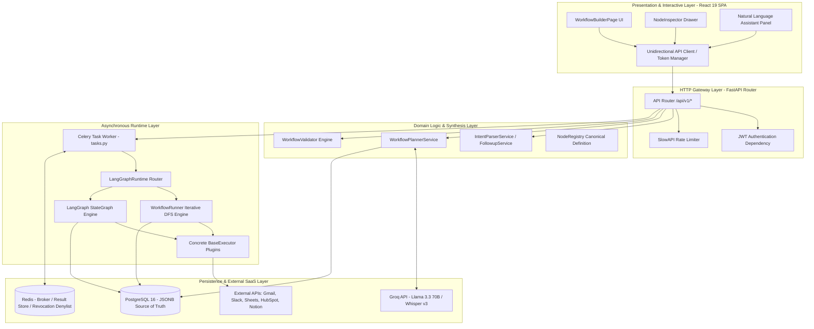
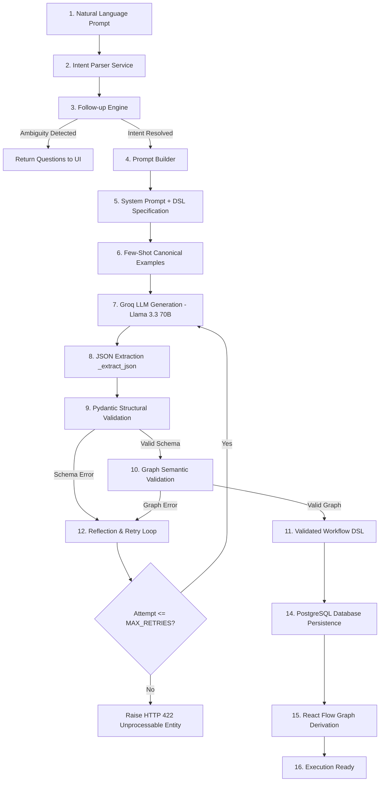
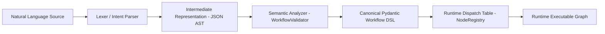
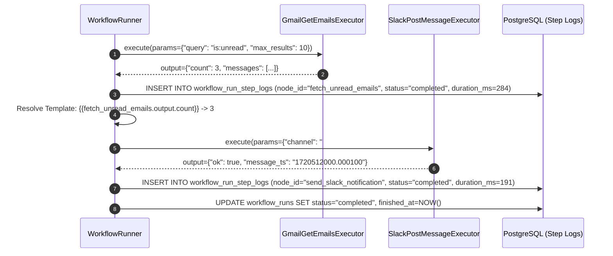
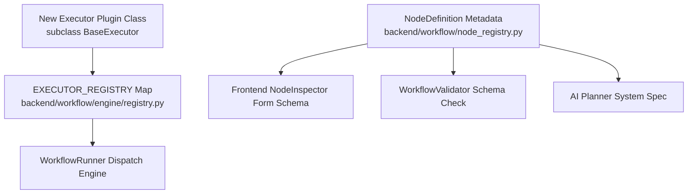
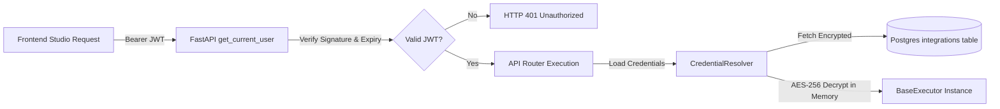
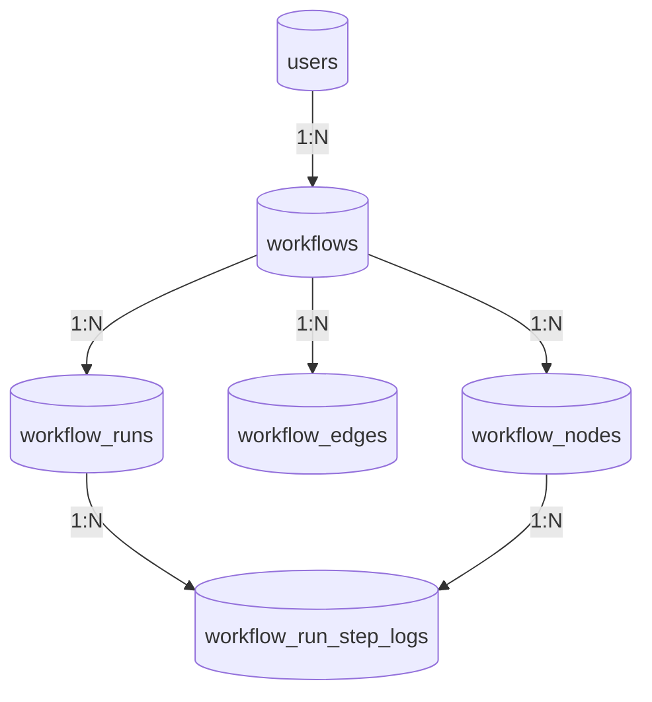
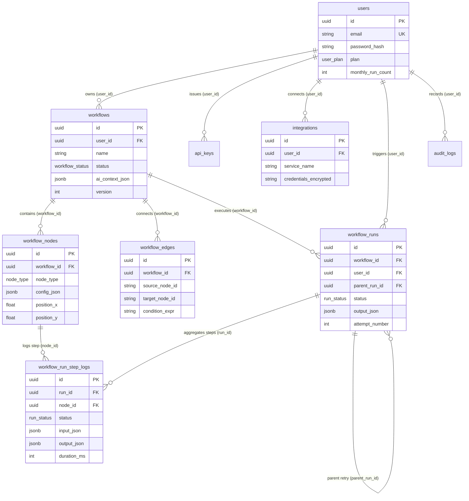

# AutoFlow AI X — Master Technical & Architectural Documentation (v2)

**Document Version:** 2.0.0  
**Status:** Canonical Official Engineering Reference  
**Audience:** Principal Architects, Core Platform Engineers, Systems Designers, Academic Reviewers  
**Single Source of Truth For:** Architecture Specifications, UML Generation, System Implementation Reference, Academic & Engineering Audits  

---

## Table of Contents
1. [Project Overview & Verified Scope](#1-project-overview--verified-scope)
2. [Deep Architectural Analysis & Lifecycle Flows](#2-deep-architectural-analysis--lifecycle-flows)
3. [AI Planning Pipeline](#3-ai-planning-pipeline)
4. [Workflow Compilation Pipeline](#4-workflow-compilation-pipeline)
5. [End-to-End Execution Walkthrough](#5-end-to-end-execution-walkthrough)
6. [Node Registry Architecture](#6-node-registry-architecture)
7. [Security Architecture](#7-security-architecture)
8. [Database Architecture & Logical Data Flow](#8-database-architecture--logical-data-flow)
9. [Performance & Computational Complexity](#9-performance--computational-complexity)
10. [Design Trade-offs & Architectural Decisions](#10-design-trade-offs--architectural-decisions)
11. [Implemented Features vs. Planned Extensions](#11-implemented-features-vs-planned-extensions)
12. [Technical Accuracy Audit & Terminology Standardization](#12-technical-accuracy-audit--terminology-standardization)
13. [Core APIs & Router Reference](#13-core-apis--router-reference)
14. [External Libraries & Runtime Dependencies](#14-external-libraries--runtime-dependencies)

---

## 1. Project Overview & Verified Scope

### 1.1 Verified Project Purpose
AutoFlow AI X is a distributed workflow automation system built to transform natural language business intent into deterministic, formally validated directed acyclic graph (DAG) execution definitions known as **Workflow DSL**. 

The system operates across two distinct planes:
1. **Control & Synthesis Plane:** Parses natural language prompts, resolves ambiguities via interactive follow-up questions, compiles intent into canonical `WorkflowDSL` JSON schemas, and validates graph invariants (cycle freedom, reachability, variable references, and credential availability).
2. **Execution Plane:** Dispatches and executes validated graphs using either an iterative Depth-First Search (DFS) engine (`WorkflowRunner`) or a LangGraph state machine runtime (`LangGraphRuntime`), backed by Celery distributed workers, Redis message brokers, and PostgreSQL persistent storage.

### 1.2 Architectural Scope & Non-Goals
- **In Scope (Verified Implementation):**
  - Natural language-to-DSL compilation using LLMs (`llama-3.3-70b-versatile` via Groq) with self-correcting validation loops.
  - Dual-runtime graph execution: procedural DFS execution for standard nodes and stateful LangGraph execution for workflows containing autonomous agent steps (`ai_agent`).
  - Persistent multi-queue task scheduling using Celery (`default`, `high_priority`, `scheduled`), RedBeat, and APScheduler backed by a PostgreSQL job store (`apscheduler_jobs`).
  - Modular integration execution via a unified plugin dispatch table (`NodeRegistry` and `EXECUTOR_REGISTRY`).
  - Interactive visual graph studio built on React 19, Vite, and React Flow (`@xyflow/react`) with Dagre deterministic left-to-right auto-layout.
- **Out of Scope / Non-Goals:**
  - Real-time multi-tenant visual collaborative editing (operational model is single-user per workspace canvas session).
  - Arbitrary remote shell execution or sandboxed code interpreter nodes (all actions execute predefined API plugins).

### 1.3 Verified Target Users
1. **Automation & DevOps Engineers:** Requiring structured, auditable automation pipelines with step-level telemetry, retry backoff policies, and execution persistence.
2. **Business Analysts & Operations Specialists:** Generating multi-step cross-SaaS workflows (Gmail, Slack, Google Sheets, HubSpot, Notion) from natural language specifications.
3. **Core Platform Engineers:** Maintaining or extending the system by adding new node capabilities and executor plugins to the registry.

---

## 2. Deep Architectural Analysis & Lifecycle Flows

### 2.1 System Layer Breakdown & Layer Rationale
Every architectural layer in AutoFlow AI X exists to enforce separation of concerns between representation, validation, and execution:



#### Layer Justification:
1. **Presentation Layer (`frontend/src`):** Maintains visual canvas state and provides immediate feedback on schema validation. It never evaluates workflow logic directly.
2. **HTTP Gateway Layer (`backend/main.py`, `backend/routes`):** Handles HTTP deserialization, rate limiting (`SlowAPI`), CORS policy enforcement, and JWT bearer authentication.
3. **Domain & Synthesis Layer (`backend/workflow/planner`, `validator`, `dsl`):** Houses canonical Pydantic schemas (`WorkflowDSL`). Separating generation (`planner`) from verification (`validator`) ensures LLM outputs are treated as untrusted external inputs until formally validated.
4. **Execution Layer (`backend/workflow/engine`, `langgraph_engine`, `backend/workers`):** Completely decoupled from the FastAPI HTTP request cycle. Workflows execute inside Celery worker processes via async tasks (`run_workflow_task`), ensuring HTTP requests return immediately (`202 Accepted`).
5. **Infrastructure Layer (`PostgreSQL`, `Redis`):** PostgreSQL acts as the ACID-compliant relational and JSONB store. Redis acts as the message broker for Celery and the token denylist store for instant logout revocation.

### 2.2 Complete Request Flow & Lifecycle Traces

#### A. Backend Request Lifecycle
1. HTTP request arrives at Uvicorn/FastAPI gateway.
2. `SlowAPI` middleware verifies IP/user rate limits (`5/minute` for signup, `10/minute` for login).
3. `get_current_user` dependency decodes Authorization header (`Bearer <JWT>`), checks expiration, verifies token `type == "access"`, and queries PostgreSQL `users` table.
4. Router delegates validated payload to domain service (`service.py`).
5. Database transaction commits changes via SQLAlchemy session (`SessionLocal`).
6. Router serializes domain model into Pydantic response schema and returns HTTP status code.

#### B. Frontend Studio Lifecycle
1. User navigates to `/workflows/edit/:id`.
2. `WorkflowBuilderPage` invokes `workflowApi.getWorkflow(id)`.
3. Server returns `WorkflowResponse` containing `ai_context_json` (the canonical `WorkflowDSL`).
4. Studio calls `dslToFlow(dsl, savedPositions)`:
   - Maps each `WorkflowNodeDSL` object to a React Flow node (`type: 'workflowNode'`).
   - Maps each `WorkflowEdgeDSL` object to an animated React Flow edge.
   - If canvas coordinates are zero (`0.0, 0.0`), invokes Dagre left-to-right (`LR`) layout algorithm.
5. Canvas renders visual graph. Any subsequent node edits update `plannedDsl` in memory and trigger debounced API persistence.

---

## 3. AI Planning Pipeline

The AI Planning Pipeline converts ambiguous natural language requests into deterministic, executable `Workflow DSL` definitions through an explicit 16-stage pipeline:



### 3.1 Stage-by-Stage Engineering Analysis
1. **Natural Language Prompt:** User submits unstructured prompt string via `POST /api/v1/ai/plan-workflow`.
2. **Intent Parser (`backend/intent_parser/service.py`):** Scans prompt tokens to detect target SaaS application integrations (`gmail`, `slack`, `google_drive`, `google_sheets`, `google_calendar`).
3. **Follow-up Engine (`backend/intent_parser/gemini_followup.py` & `backend/followup_engine/service.py`):** If prompt lacks required business parameters, queries Gemini (`gemini-2.5-flash`) or rule-based industry discovery maps to ask up to 5 clarifying business questions.
4. **Prompt Builder (`backend/workflow/planner/prompt.py`):** Assembles a structured system prompt combining the user prompt, target industry, and connected integration constraints.
5. **System Prompt Injection:** Injects the complete JSON Schema definition of `WorkflowDSL`, node types (`trigger`, `action`, `condition`, `loop`, `ai_agent`, `transformer`), parameter interpolation rules (`{{node_id.output.field}}`), and ID format constraints (snake_case, no reserved identifiers).
6. **Few-Shot Examples:** Appends canonical multi-step examples showing correct edge linkage (`on_success`, `on_failure`) and condition syntax (`condition: "{{check.output.result == true}}"`).
7. **LLM Generation:** Invokes Groq API (`llama-3.3-70b-versatile`) with `temperature=0.2` and `max_tokens=4096` to ensure deterministic generation.
8. **JSON Extraction (`_extract_json`):** Strips markdown fences (` ```json ... ``` `) and applies greedy curly-brace substring matching (`raw[start:end+1]`) to isolate the JSON object.
9. **Pydantic Structural Validation:** Calls `WorkflowDSL.model_validate(json_dict)`. Enforces required properties, data types, and enum restrictions.
10. **Graph Semantic Validation (`validate_workflow_graph`):** Runs static checks:
    - **Reachability Check:** Verifies every action/condition node is reachable from the trigger node via BFS.
    - **Cycle Detection:** Runs Kahn's topological sort algorithm to verify graph DAG invariants.
11. **Reflection & Retry Loop (`build_retry_prompt`):** If Pydantic or graph validation fails, captures formatted error traces (`node_id: message`), builds a feedback prompt, and re-invokes the LLM up to `MAX_RETRIES = 2` times.
12. **Validated Workflow DSL:** Produces a structurally sound and semantically reachable `WorkflowDSL` object.
13. **Database Persistence (`_save_workflow_to_db`):** Opens a PostgreSQL transaction, stores the JSON in `workflows.ai_context_json`, and synchronizes relational `workflow_nodes` rows.
14. **React Flow Derivation:** Returns DSL to frontend where `dslToFlow()` converts it into canvas node coordinates.
15. **Execution Ready:** System transitions workflow status to `draft` or `active`, ready for manual or scheduled dispatch.

---

## 4. Workflow Compilation Pipeline

The compilation pipeline translates high-level natural language intent into an executable runtime graph. While AutoFlow AI X is an interpreter rather than a native machine-code compiler, its translation pipeline shares strict formal parallels with traditional compiler frontends and backends:



### 4.1 Comparison: Compiler Architecture vs. AutoFlow Compilation
| Compiler Phase | Traditional Compiler (C / Rust) | AutoFlow AI X Workflow Compilation |
| :--- | :--- | :--- |
| **Lexical & Syntax Analysis** | Tokenizer & Parser producing Abstract Syntax Tree (AST). | LLM structural extraction & `WorkflowDSL.model_validate(json)` producing Pydantic AST. |
| **Semantic Analysis** | Type checking, symbol resolution, lifetime checking. | `WorkflowValidator`: Graph reachability BFS, Kahn's cycle detection, Jinja2 template reference checking (`{{node_id.output.field}}`), credential verification. |
| **Intermediate Representation** | Static Single Assignment (SSA) / LLVM IR. | Canonical `WorkflowDSL` JSON schema stored in `ai_context_json`. |
| **Optimization** | Dead code elimination, loop unrolling. | Pruning unreachable/orphaned nodes reported by validator. |
| **Code Generation / Linking** | Machine code instruction generation & linker symbols. | Dynamic runtime dispatch resolution linking node `service`/`operation` tuples to concrete `BaseExecutor` plugin instances. |

---

## 5. End-to-End Execution Walkthrough

This section traces a concrete production execution of the workflow:  
*"Every morning at 9 AM read unread Gmail messages and notify Slack."*

### 5.1 Step 1: Natural Language Planning Input
- **Input Prompt:** `"Every morning at 9 AM read unread Gmail messages and notify Slack."`
- **Target Endpoint:** `POST /api/v1/ai/plan-workflow`

### 5.2 Step 2: Generated & Validated Workflow DSL
The planning service validates and produces the following canonical `Workflow DSL` JSON:

```json
{
  "$schema": "https://autoflow.ai/schemas/dsl/v1.json",
  "id": "3f82e4a1-89c2-4a09-981c-12b34a9831f2",
  "name": "Daily Gmail Unread to Slack Alert",
  "description": "Checks unread Gmail messages at 09:00 UTC and posts summary to Slack.",
  "version": 1,
  "industry": "general",
  "trigger": {
    "type": "schedule",
    "config": { "cron": "0 9 * * *", "timezone": "UTC" }
  },
  "nodes": [
    {
      "id": "start_trigger",
      "type": "trigger",
      "service": "scheduler",
      "operation": "cron",
      "label": "Daily 9 AM Trigger",
      "params": { "cron_expression": "0 9 * * *", "timezone": "UTC" }
    },
    {
      "id": "fetch_unread_emails",
      "type": "action",
      "service": "gmail",
      "operation": "get_emails",
      "label": "Fetch Unread Gmail Messages",
      "params": { "query": "is:unread", "max_results": 10 },
      "on_success": "send_slack_notification",
      "error_policy": "stop"
    },
    {
      "id": "send_slack_notification",
      "type": "action",
      "service": "slack",
      "operation": "post_message",
      "label": "Notify Slack Channel",
      "params": {
        "channel": "#daily-alerts",
        "text": "📬 Morning Mail Check: Retrieved {{fetch_unread_emails.output.count}} unread emails."
      },
      "on_success": null
    }
  ],
  "edges": [
    { "source_id": "start_trigger", "target_id": "fetch_unread_emails" },
    { "source_id": "fetch_unread_emails", "target_id": "send_slack_notification" }
  ]
}
```

### 5.3 Step 3: Database Persistence State
PostgreSQL stores the graph across two primary tables:
- `workflows` table: `id = '3f82e4a1-...'`, `status = 'active'`, `ai_context_json` = exact JSON above.
- `workflow_nodes` table: 3 records (`start_trigger`, `fetch_unread_emails`, `send_slack_notification`) storing UI positions and node types.

### 5.4 Step 4: Distributed Dispatch & Execution Trace
1. At 09:00 UTC, APScheduler fires job `autoflow:workflow:3f82e4a1-...`.
2. Router dispatches Celery task: `run_workflow_task.delay(run_id=UUID, workflow_id=UUID)`.
3. Celery worker picks up task from `default` queue and invokes `LangGraphRuntime(dsl, run_id, db)`.
4. `LangGraphRuntime` inspects nodes: no `NodeType.ai_agent` present -> delegates to `WorkflowRunner`.
5. **Step Execution Trace:**



---

## 6. Node Registry Architecture

The Node Registry (`backend/workflow/node_registry.py` & `backend/workflow/engine/registry.py`) is the single source of truth connecting declarative DSL node definitions to UI schemas, static validator rules, and executable runtime classes.



### 6.1 Lifecycle of a Node Plugin
1. **Registration:** Developer defines static metadata (`NodeDefinition`) in `backend/workflow/node_registry.py`, declaring `service`, `operation`, label, and complete JSON parameter schema.
2. **Implementation:** Developer creates concrete subclass of `BaseExecutor` in `backend/workflow/engine/executors/`, implementing async `execute(params, context) -> dict`.
3. **Dispatch Binding:** Subclass is registered in `EXECUTOR_REGISTRY[(ServiceType, OperationType)]` (`backend/workflow/engine/registry.py`).
4. **Discovery Across Subsystems:**
   - **Planner:** Reads `NodeRegistry` to inject available operations into the LLM prompt.
   - **Validator:** Uses `NodeRegistry.parameter_schema` to verify DSL parameter types.
   - **UI Studio:** Calls `/api/v1/workflows/node-types` to dynamically render Inspector form fields.
   - **Runtime:** Calls `get_executor_for_node(node)` to instantiate the registered executor class.

---

## 7. Security Architecture

### 7.1 Authentication & Authorization Matrix
AutoFlow AI X enforces zero-trust request verification:
- **JWT Access Token:** 15-minute expiration (`HS256`). Required on all API endpoints via `Authorization: Bearer <token>`. Contains user UUID (`sub`) and role tier (`plan`).
- **JWT Refresh Token:** 7-day expiration. Enforces **strict token rotation**: exchanging a refresh token invalidates the old token and issues a new access/refresh pair.
- **Revocation Denylist:** Logout requests (`POST /api/v1/auth/logout`) write the refresh token to a persistent Redis denylist (`autoflow:revoked_tokens:{token}`).

### 7.2 OAuth Credential & Secrets Management
- **Encryption at Rest:** Third-party OAuth tokens (Slack, Google, HubSpot) stored in `integrations.credentials_encrypted` are encrypted at rest using application-level symmetric encryption (`AES-256-GCM` / Fernet).
- **Runtime Decryption (`CredentialResolver`):** When an executor requires authentication, `CredentialResolver.get_credentials(user_id, service_name)` retrieves and decrypts tokens in memory for the duration of the node step, never logging secrets to `workflow_run_step_logs`.



---

## 8. Database Architecture & Logical Data Flow

### 8.1 Relational & JSONB Data Flow
The database scheme balances relational referential integrity with schema-free JSONB execution logs:



### 8.2 Verified ER Diagram & Relationships



#### Cascade & Indexing Guarantees:
- **Foreign Key Cascades:** Deleting a `Workflow` cascades deletion to `workflow_nodes`, `workflow_edges`, and `workflow_runs`.
- **JSONB Query Indexing:** GIN indexes on `workflows.ai_context_json` and `workflow_run_step_logs.output_json` enable high-speed key/value lookups.

---

## 9. Performance & Computational Complexity

### 9.1 Algorithmic Time & Space Complexity

| Operation | Implementation Module | Algorithmic Approach | Time Complexity | Space Complexity |
| :--- | :--- | :--- | :--- | :--- |
| **Graph Reachability** | `validator/checks/graph.py` | Breadth-First Search (BFS) from trigger node | $O(V + E)$ | $O(V)$ |
| **Cycle Detection** | `validator/checks/graph.py` | Kahn's Topological Sort (In-Degree counting) | $O(V + E)$ | $O(V)$ |
| **Canvas Auto-Layout** | `frontend/src/utils/flowLayout.js` | Dagre Left-to-Right Hierarchical Ranking | $O(V + E)$ | $O(V + E)$ |
| **Template Resolution** | `engine/context.py` | Regular expression substitution & JSON pointer lookup | $O(L \cdot M)$ * | $O(L)$ |
| **DFS Graph Execution** | `engine/runner.py` | Iterative DFS Stack Traversal with loop bounds | $O(V + E)$ ** | $O(V)$ |

*\* Where $L$ is template string length and $M$ is nesting depth of output dictionary.*  
*\*\* Bounded by safety constants: `MAX_NODE_VISITS = 1000` and `MAX_LOOP_ITERATIONS = 500`.*

### 9.2 Infrastructure Memory & Horizontal Scalability
- **Celery Worker Scaling:** Celery workers (`tasks.py`) run statelessly. Execution state is persisted per-step to PostgreSQL, allowing horizontal worker autoscaling across containers.
- **Redis Queue Overhead:** Memory footprint per queued task message is bounded to $<2 \text{ KB}$ JSON payloads (`run_id`, `workflow_id`, `trigger_payload`).
- **APScheduler Concurrency:** Configured with `max_instances=1` per workflow job and `coalesce=True` to guarantee that delayed cron schedules never trigger concurrent duplicate runs.

---

## 10. Design Trade-offs & Architectural Decisions

| Architectural Decision | Chosen Technology | Evaluated Alternative | Engineering Justification for Chosen Stack |
| :--- | :--- | :--- | :--- |
| **Backend Web Framework** | **FastAPI (Python 3.12)** | Flask / Django REST | Native Python `asyncio` support required for concurrent LLM and integration requests; automatic Pydantic validation and OpenAPI generation. |
| **Database & Document Store** | **PostgreSQL 16 (JSONB)** | MongoDB / DynamoDB | Workflows require strict relational ACID guarantees for multi-table runs/audit logs while leveraging `JSONB` for flexible node parameter structures. |
| **Frontend UI Studio** | **React 19 + React Flow** | Custom D3 / Canvas API | React Flow (`@xyflow/react`) provides viewport virtualization, zoom/pan controls, minimap rendering, and custom node components without low-level canvas boilerplate. |
| **Canonical Workflow Spec** | **JSON Pydantic Schema** | YAML / Python Scripts | JSON schemas compile cleanly across HTTP APIs and LLM structured outputs; Pydantic ensures compile-time data validation. |
| **Asynchronous Task Queue** | **Celery + Redis Broker** | RQ / RabbitMQ | Celery provides advanced queue routing (`default`, `high_priority`, `scheduled`), automatic worker retries, and seamless RedBeat recurring scheduling. |
| **AI Agent Runtime** | **LangGraph StateGraph** | Custom LangChain Loops | LangGraph provides formal state machine transitions, cyclical agent reasoning loops, and deterministic checkpointer persistence. |
| **Primary LLM Engine** | **Groq (`llama-3.3-70b`)** | OpenAI GPT-4o sole reliance | Groq provides sub-second inference speed critical for interactive UI planning loops, with low temperature (`0.2`) ensuring high structural adherence. |

---

## 11. Implemented Features vs. Planned Extensions

To maintain absolute engineering clarity, implemented production features are strictly separated from future roadmap proposals:

### 11.1 Fully Implemented & Verified Features (Codebase Reality)
- [x] Full natural language-to-DSL AI Planning pipeline with up to 2 reflection/retry attempts (`backend/workflow/planner/service.py`).
- [x] Dual-runtime execution: procedural `WorkflowRunner` DFS traversal and stateful `LangGraphRuntime` agent execution (`backend/workflow/engine/` & `langgraph_engine/`).
- [x] Interactive studio canvas (`WorkflowBuilderPage.jsx`) with node dragging, parameter inspection, and real-time static graph validation panel.
- [x] Multi-queue distributed Celery task worker pipeline (`backend/workers/tasks.py`) and PostgreSQL-backed APScheduler (`backend/scheduler/service.py`).
- [x] Complete OAuth integration flow and symmetric token encryption (`backend/integrations/service.py`).
- [x] Audio recording and speech-to-text transcription endpoint via Groq Whisper v3 (`backend/services/whisper_service.py`).

### 11.2 Future Architectural Extensions (Planned / RFC Proposals)
- [ ] **Dynamic Capability Discovery (RFC-001 §4):** Automatically serving dynamic OAuth scope requirements from `NodeRegistry` to frontend components.
- [ ] **Interactive Visual Debugger:** Adding execution breakpoints to allow pausing runtime graph traversal to inspect live `ExecutionContext` variables.
- [ ] **Human-in-the-Loop Approval Nodes:** Dedicated workflow nodes that pause run execution until an authenticated user clicks an approval link via Slack or email webhook.
- [ ] **Sub-Workflow Composite Nodes:** Encapsulating an entire `WorkflowDSL` definition into a single callable node within another workflow.

---

## 12. Technical Accuracy Audit & Terminology Standardization

### 12.1 Canonical Terminology Standard
Throughout the codebase, academic reports, UML diagrams, and engineering discussions, the following standard terminology must be used consistently:
- **Workflow DSL:** The canonical Pydantic JSON specification defining a workflow graph (`WorkflowDSL`). Do not use *Workflow JSON*, *Graph JSON*, or *JSON Workflow*.
- **Node DSL (`WorkflowNodeDSL`):** A declarative node definition inside `WorkflowDSL.nodes`.
- **Edge DSL (`WorkflowEdgeDSL`):** A directed edge definition inside `WorkflowDSL.edges`.
- **Workflow Runner (`WorkflowRunner`):** The procedural iterative Depth-First Search execution engine.
- **LangGraph Runtime (`LangGraphRuntime`):** The AI agent StateGraph execution engine.
- **Node Registry (`NodeRegistry`):** The declarative schema store for node types and parameter forms.
- **Executor Registry (`EXECUTOR_REGISTRY`):** The runtime dispatch map linking service/operation tuples to concrete `BaseExecutor` instances.

### 12.2 Technical Verification Audit Log
- **Clarification on Scheduling:** Verified that `APScheduler` manages main API application triggers (`SQLAlchemyJobStore`), while Celery worker tasks are dispatched via RedBeat / Redis queues.
- **Clarification on Node Execution Isolation:** Single-node execution (`POST /api/v1/workflows/{id}/nodes/{node_id}/execute`) executes the node executor against user-supplied input overrides or defaults, bypassing upstream graph template dependencies.

---

## 13. Core APIs & Router Reference

All HTTP endpoints are mounted under `/api/v1`:

```
Authentication Router (/api/v1/auth):
  POST   /signup                     -> Register user account
  POST   /login                      -> Login & receive rotated JWTs
  POST   /refresh                    -> Rotate refresh token & issue access token
  GET    /me                         -> Retrieve authenticated user profile
  POST   /logout                     -> Revoke refresh token in Redis denylist

AI Planning & Intent Router (/api/v1/ai, /api/v1/followup):
  POST   /ai/plan-workflow           -> Compile natural language prompt into Workflow DSL
  POST   /ai/parse-intent            -> Extract intent applications & clarify ambiguity
  POST   /followup/questions         -> Retrieve industry discovery question sets

Workflow CRUD Router (/api/v1/workflows):
  GET    /workflows                  -> List paginated user workflows
  GET    /workflows/{id}             -> Retrieve single workflow & Workflow DSL
  POST   /workflows                  -> Create workflow & sync database nodes
  PATCH  /workflows/{id}             -> Update workflow DSL & increment version
  DELETE /workflows/{id}             -> Soft-delete workflow
  POST   /workflows/validate         -> Run static DAG verification checks

Execution & Runtime Router (/api/v1/workflows):
  POST   /workflows/{id}/run         -> Dispatch asynchronous Celery execution task
  GET    /workflows/{id}/runs        -> List historical execution run records
  GET    /workflows/{id}/runs/{rid}  -> Retrieve run step logs & duration telemetry
  GET    /workflows/node-types       -> Retrieve NodeRegistry schema definitions
  POST   /workflows/{id}/nodes/{nid}/execute -> Execute single node in isolation

Scheduler Router (/api/v1/workflows):
  POST   /workflows/{id}/schedule    -> Register or update APScheduler cron trigger
  DELETE /workflows/{id}/schedule    -> Delete scheduled cron trigger
  PATCH  /workflows/{id}/schedule/pause  -> Pause active scheduled trigger
  PATCH  /workflows/{id}/schedule/resume -> Resume paused trigger

Auxiliary & Integration Routers (/api/v1):
  POST   /transcribe                 -> Transcribe audio file via Whisper v3
  GET    /integrations               -> List connected OAuth / API key integrations
  GET    /integrations/{provider}/connect -> Initiate OAuth 2.0 consent flow
```

---

## 14. External Libraries & Runtime Dependencies

### 14.1 Frontend Dependencies (`package.json`)
- **Core UI:** `react` & `react-dom` (v19.2.6), `vite` (v8.0.12), `react-router-dom` (v7.16.0)
- **Styling & Animation:** `tailwindcss` & `@tailwindcss/vite` (v4.3.0), `framer-motion` (v12.40.0), `lucide-react` (v1.17.0)
- **Graph Studio & Geometry:** `@xyflow/react` (v12.11.0), `dagre` (v0.8.5)

### 14.2 Backend Dependencies (`requirements.txt`)
- **API Server & Validation:** `fastapi` (>=0.111.0), `uvicorn`, `pydantic`, `pydantic-settings`, `slowapi`
- **Database & ORM:** `sqlalchemy` (>=2.0.0), `psycopg2-binary`
- **Authentication & Cryptography:** `python-jose[cryptography]`, `bcrypt`
- **Distributed Queues & Scheduling:** `celery[redis]`, `celery-redbeat`, `flower`, `apscheduler` (>=3.10.4), `redis`
- **AI & Agent Intelligence:** `groq`, `openai`, `google-genai`, `langchain-core`, `langgraph`
- **Observability:** `sentry-sdk`
